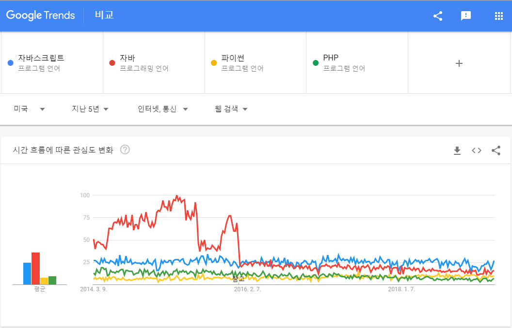

# Tech Stack(기술 스택) <Badge text="jwkim2" />

저희 팀에서 사용하는 기술 스택에 대하여 왜 각 기술들을 선택하였는지에 대하여 설명합니다.

## SCM(Source Code Management)

SCM 의 경우는 **Git**을 사용합니다. 
아직도 CVS, SVN등을 SCM 메인으로 쓰고 있다면 해당 팀 탈출을 권장 드립니다. (ㅠㅠ) 예전 회사에 타팀 개발자분이 "우리 팀은 딱히 버전 관리를 안하니까 Git 까지 필요 없고 SVN 정도면 되는거 아니야?" 라고 하시길래, 제가 "Git을 포기하시면 버전 관리를 포기하는 것이 아니고 Git과 연결된 모든 생태계를 포기하는 것입니다." 라고 했는데 당시 마음에 와 닫지는 않았던 것 같습니다. Git이 소스코드 버전 관리용도로만 알고 계시면 큰 착각입니다. 오픈 소스 최대 생태계인 GitHub, NPM, Docker Hub 등등 이 모든 서비스들이 Git을 기반으로 하고 있고 DevOps 의 CI/CD 도 Git을 기반으로 하고 있습니다. Git을 안 쓴다는 말은 그 거대한 모든 생태계를 모두 포기한다는 것과 동일하다고 해도 과언이 아닙니다.(물론 Git을 몰라도 NPM, Docker 등을 활용 할 수 있지만, 제대로 활용하기 위해서는 Git이 필수적입니다.)

### Git 클라우드 서비스

Git은 어찌 보면 단순히 도구에 불과할 뿐이고 실질적으로 Git을 사용하게 되면 Git을 호스팅(?) 해주는 서비스를 선택해야 합니다. Git 이라는 것인 기본적으로 로컬에서 돌아가지만 팀으로 작업을 하기 위해서는 Remote Repository 필요합니다. 이를 호스팅 또는 운영 해주는 대표적인 서비스는 [GitHub](https://http://github.com), [GitLab](https://http://gitlab.com), [BitBucket](https://bitbucket.org) 이 있습니다.

#### 주요 Git 클라우드 서비스 비교

| | GitHub | GitLab | BitBucket |
| - | - | - | - |
| 특징 | 오픈 소스 최대 허브 NPM, Docker Hub등 타 오픈 소스 생태계와 연결되어 있음 | 서비스 자체가 오픈 소스 | Jira, Confluence 등 [Atlassian](https://www.atlassian.com) 계열 서비스들과 연동이 편리 |
| Public Repo  | 무료 | 무료 | 무료 |
| Private Repo | **Free** 없음  **Individuals** $7/user/month  **Teams** $9/user/month Starts at $25 / month and includes your first 5 users  **Enterprise** $21/user/month Self-hosted or cloud / month and includes your first 5 users | **Free** $0/user/month CI 2000 mins /group/month  **Bronze** $4/user/month CI 2000 mins /group/month  **Silver** $19/user/month CI 10,000 mins /group/month  **Gold** $99/user/month CI 50,000 mins /group/month   | **Free** $0/user/month Up to 5 users CI 50 mins/month  **Standard** $2/user/month Start at $10/month CI 500 mins/month  **Premium** $5/user/month Start at $25/month CI 1000 mins/month   |
| Self-hosted  | **Enterprise Plan** $21/user/month | **오픈 소스(무료)** | **유료(라이선스)** $10/up to 10 users $2500/up to 25 users $4500/up to 50 users $8300/up to 100 users $16,500/up to 250 users |

업데이트:GitHub가 최근 개인에 한해서 3명까지 공유할수 있는 무제한 repo 를 제공한다고 합니다.

Git 클라우드 서비스들이 지원하는 내용은 다 비슷비슷하기 때문에 서비스상의 큰 차이는 없습니다. 단, 오픈 소스의 경우 이미 대부분의 오픈 소스 생태계가 GitHub를 중심으로 구축이 되어 있기 때문에 GitHub를 사용해야 합니다. 실질적으로 어떤 Git 서비스를 선택하여야 하나는 이어지는 CI와 함께 알아보도록 하겠습니다.

## CI/CD

DevOps 개발 환경과 더불어 요즘 CI/CD는 필수 사항입니다.(현재 CI/CD 를 안 쓴다고 해당 회사를 탈출하라고까지 권하진 않겠습니다. 다만, 팀장급이나 CTO가 활용 할 줄 모른다면 탈출 하시기 바랍니다.)
여지껏 CI/CD 를 활용하지 않고 DevOps 와 친숙하지 않다고 하더라도 차후 연재 될 DevOps 및 CI/CD 포스팅을 보시고 적극 활용하시기를 바랍니다.

CI/CD 서비스를 비교하기 위해서는 우선 CI/CD 가 무엇인지를 알아야 하기에 아직 개념이 익숙하지 않는 분들을 위해 간단히 설명 드리겠습니다. 

**CI(Continuous Integration)** : 지속적인 통합 
**CD(Continuous Delivery)** : 지속적인 배포

쉽게 설명하면, **자동으로 여러 시스템이 통합이 되고 배포가 된다.** 
영문 표현의 지속적이라는 단어 보다는 사실 **자동으로**가 더 중요한 부분인 것 같아 수정하였습니다. 그럼 무엇이 통합이 되고 무엇이 배포가 어떤 식으로 된다는거지? 라는 의문을 가지게 될 것입니다. 구체적인 사래를 들어서 설명하겠습니다.

A라는 웹 개발자는 작업이 완료되면, 변경 사항을 Change Log 라는 파일에 기입하고 버전을 올리고 [gulp](https://gulpjs.com) 또는 [webpack](https://webpack.js.org/)을 통해서 웹소스를 번들링하고 번들링 된 파일을 ftp 를 열어서 서버에 업로드를 하고 업로드가 완료되면 Blue/Green 배포를 하기 위해 기존의 소스와 업데이트한 소스의 라우팅을 스왑합니다. 팀원들에게 공지를 하기 위해서 Slack 을 열어서 관련된 채팅방을 찾고 해당 방에 업데이트 사항을 공유합니다.

B라는 앱 개발자는 작업이 완료되면, 안드로이드와 iOS를 각각 빌드하고 각 빌드가 완료될 때까지 기다렸다가 완료가 되면 구글 플레이 스토어와 앱스토어를 각각 열고 업데이트 파일을 일일이 올리고 마찬가지로 변경사항을 기록하고 팀원들에게 Slack 으로 공지를 합니다.

중요한건 이런 일을 둘다 개발 중에 수백번 이상하게 된다는 것입니다.

다음은 CI/CD를 사용하는 경우입니다.

A,B 둘다 git에 커밋 합니다. **끝입니다.** 위에 언급한 모든 일련의 과정들이 자동화 되어 최종적으로 Slack 에 공유가 되고 배포 실패의 경우도 배포 실패 사유와 함께 알림이 옵니다.

이것이 CI/CD 를 사용하는 이유입니다. 이 모든 과정이 어떻게 자동화 되는거지? 궁금할 수 있는데 CI/CD 는 일반적으로 CI 서버가 소스를 받고 소스와 동봉된(?) 스크립트를 실행하게 되어 있습니다.
스크립트는 bash 가 될 수도 있고, node, PowerShell등 설정한 환경에 따라서 무엇이든 될 수 있습니다. 스크립트를 실행하게 된다는 것은 스크립트내에서 내가 하고 싶은 무엇이든 할 수 있다는 뜻이 됩니다.
그것이 문서를 갱신하거나 FTP 에 업로드를 하거나 스토어에 배포하는 등 원하는 자동화 내용을 명시하기만 하면 됩니다.
사실 어차피 통합과 배포가 같이 이루어짐으로 CI와 CD를 따로 생각하는 것이 큰 의미가 없기에, 앞으로는 CI라고만 표현하도록 하겠습니다. (CI 활용법 차후 포스팅 하겠습니다.)

### CI 서비스 비교

CI 라는 것이 사실 특정 서비스에 종속적인 것은 아니나 각 Git 서비스별로 해당 서비스에서 공식으로 지원하거나 Git 서비스 자체에 내장되어 있는 CI 서비스들이 있습니다.
다음은 주요 CI 서비스 비교입니다.

|         | Travis       | GitLab CI | BitBucket Pipeline | Jenkins |
| ------- | ------------ | --------- | --------------------------- | ------- |
| Git 서비스 | GitHub       | GitLab    | BitBucket                   | 없음      |
| 특징 | iOS 빌드 지원 | Self hosted CI Runner 지원 | Atlassian 연동 용이 | 인프라 배포 가능 |
| Build Script  소스에 포함 | 포함 | 포함 | 포함 | 미포함 |
| 가격      | **무료** 오픈소스만 해당  **Bootstrap** $69/month 1 Concurrent job  **Startup** $129/month 2 Concurrent job  **Small Business** $249/month 5 Concurrent job  **Premium** $489/month 10 Concurrent job   | Plan별 기본 제공 시간 +  Self hosted CI Runner(무료) | Plan별 기본 제공 시간 +  $10/month for 1000 mins | 설치형으로 빌드에 따른 비용이 없고 직접 호스팅하는 비용 |
| Self Hosting | 불가 | 가능 | 불가 | 가능 |

Butbucket 의 Self Hosting CI Bamboo 는 제외하였습니다.

CI 서비스 또한 Git 서비스들처럼 큰 차이를 가지고 있지는 않습니다만 약간의 서로 다른 특징들을 보유하고 있습니다.

#### Travis

GitHub 와 별도의 서비스로 존재하나 GitHub와 연동이 거의 원클릭 수준으로 편리하게 되어 있고 Hook 등의 별도 설정을 하지 않아도 자동으로 인식합니다. 원래 별도 회사였다가 GitHub에서 인수한 것으로 알고 있습니다.(GitHub는 최근에 MS 가 인수하였습니다.) 클라우드 서비스 중에서는 Travis 만이 유일하게 iOS 빌드를 지원합니다. Self Hosting 하는 다른 서비스들의 경우 직접 Mac에 설치하면 iOS 빌드가 가능합니다만 클라우드상에서 iOS 빌드를 바로 뽑아 내고 싶다고하면 Travis 가 유일합니다. 오픈 소스용 무료 [travis.org](https://travis.org) 와 Private Repo 를 위한 유료 [travis.com](https://travis.com) 을 별도로 운영하고 있고 내용상은 동일합니다. Travis는 설치형을 지원하고 있지 않습니다.

#### GitLab CI

GitLab 서비스에 내장되어 있습니다. GitLab CI 만이 유일하게 Runner 를 직접 호스팅 할 수 있게 지원합니다. Runner란 repo로 부터 소스를 받고 해당 스크립트를 돌리는 작업을 하는 역할을 합니다. 타 서비스들은 CI가 돌아가는 Runner 들을 서비스들이 직접 호스팅을 하고 있으나 GitLab의 경우 Shared Runner 를 이용하여 Plan 에 해당하는 만큼 사용할 수 있고 별도의 나만의 Dedicate Runner 를 두어서 추가로 이용하거나 더 높은 성능 혹은 자사에 특화 된 환경에서 실행을 할 수 있게 지원하고 있습니다. 이는 단순히 Runner 만 별도 운영함으로써 무제한 고성능 CI를 활용 할 수 있게 됩니다. GitLab 설치형 서비스와 헷갈릴 수가 있는데 GitLab을 설치할 경우 CI는 내장되어 같이 설치가 되고, 굳이 설치를 하지 않고 GitLab의 클라우드 서비스를 사용하면서도 Runner 만 따로 빼서 운용 할 수도 있습니다.

#### BitBucket Pipeline

BitBucket 서비스에 내장되어 있습니다. 솔직히 GitLab에 비해서 Plan 별로 주어지는 CI 시간이 너무 짭니다.(ㅠㅠ) GitLab Free Plan으로 기본 2,000분/월의 시간을 주는데, BitBucket은 50분/월뿐이 안됩니다. 유료 Plan 으로 올려도 500분/월 뿐이 되지 않습니다. 게다가 추가 1000분당 $10 를 지불해야 합니다. 안정적으로 호스팅해주고 서버들 운영해주고 그런 클라우드 서비스를 쓰는 입장에서 해당 가격이 부당하다고 생각이 되지는 않으나 GitLab 에 비해서 너무 짜다보니 비교가 될 수 밖에 없습니다. BitBucket 에도 설치형 CI Bamboo 라는 것이 존재하는데 유료임에 불구하고 무료인 Jenkin 나 GitLab CI 에 비해서 딱히 장점이 없어서 따로 명시하지 않았습니다.

#### Jenkins

Jenkins는 JAVA 기반의 오픈 소스로서 CI의 아버지로 봐도 무방합니다. 사실 CI들이 이만큼 발전한 것은 Jenkins 의 공이 큽니다. 예전에 Git 클라우드 서비스들이 CI를 내장하고 있지 않을 때부터 시작하여 다양한 환경을 통합하고 빌드 자동화를 지원하기 시작했고 많은 사람들이 사용하기 시작하면서 CI/CD 에 대한 인식을 많이 퍼트리는 역할을 했습니다. 제일 오래 되었기 때문에 여전히 사용자도 많고 다양한 플러그인들이 존재합니다.

보통 CI 라는고 하면 Jenkins 를 많이 떠올리고 실제로 많이들 사용하는데 사실 다른 CI 서비스들 제대로 써본 적이 없고 다들 Jenkins, Jenkins 하니까 그냥 시작하는 경우를 많이 보았습니다.
하지만 현재 Git 클라우드 서비스에서 제공하는 CI 들의 수준도 높아지고 사용성도 편리 해져서 정말 Jenkins 가 필요해서 쓰는 상황이 아니라면 추천하고 싶지는 않습니다.(자세한 이유는 다음 단락에 나옵니다.)

### Git 및 CI 서비스 정리

필자는 상위 언급한 Git 서비스 뿐 아니라 MS등 다른 Vendor 들 서비스와 설치형 Git 서비스들 및 언급한 모든 CI 와 CI 전용 타 Vendor 까지 모두 직접 설치 또는 설정 운영해서 사용해본 결과,
각 서비스별 장단점 및 선택의 이유가 몇가지로 정리 되어 있습니다.

우선 사내 인프라팀이 따로 존재하는 경우를 제외하고 Self Hosting 은 잘 사용하지 않습니다. 인프라를 직접 구축할 경우, 본 작업인 프로젝트 개발에 쏟아야 할 시간을 인프라 설치, 운영, 관리 쪽으로 분산 되게 됩니다. 공용 인프라 팀이 IDC를 통해서 제대로 인프라를 관리하지 않고 사내에서 간의로 인프라를 구축하여 사용하다가 물리적인 서버가 고장이 나거나 정전이 나거나 회사가 이사를 가는 등 다양한 형태에 의해서 개발에 쏟아야 할 시간이 분산됩니다. 인프라팀이 구축을 하더라도 제대로 된 보안을 위해서는 VPN 등을 통해서만 사내 인프라가 접근이 가능하게끔 해야 하는데 그 정도가 갖춰져 있지 않다면 클라우드를 사용하는 것과 큰 차이가 없습니다. 비용적인 측면에서도 무료로 사용 할 수 있는 클라우드 서비스들이 있기 때문에 굳이 감가상각이 들어가는 장비를 구매하여 사용할 이유가 없습니다. 클라우드 서비스라고 문제가 없겠냐마는 직접 운영하는 것보다 사고가 적고 대응도 빠릅니다. Git과 CI 같이 개발의 코어적인 부분은 최대한 안정성을 확보해야 하기 때문에 클라우드 서비스를 선택하였습니다.(물론 인프라팀에서 제공해주면 "땡큐"하고 사용합니다. 망분리의 경우는 당연히 설치형입니다. 혹시나 AWS등에 인프라를 구축해서 사용 중이면 직접 운영보다 돈 많이 나옵니다.)

CI에서 Build Script 가 소스코드에 포함되지 않는 서비스는 제외합니다. Travis, GitLab CI 는 소스코드상에 빌드에 필요한 스크립트를 포함시키도록 되어 있습니다. 소스 코드에 Build Script 가 포함되어 있으면 Git에 의해 자연스럽게 버전 관리가 되어 집니다. Git으로 예전 소스를 돌려본다고 해도 해당 시점의 빌드 환경을 스크립트에서 그대로 있어 재현이 가능합니다. Jenkins 의 큰 단점은 소스 따로 빌드 스크립트 따로 라는 점입니다. 소스는 Git에 있고 빌드에 대한 스크립트 및 환경은 Jenkins 에 있습니다. Jenkins 서버가 날라가 버리면 빌드 환경도 읽어 버리게 됩니다. 물론 Jenkins 도 별도의 백업이 가능하나 소스에 자연스럽게 해당 버전에 맞는 빌드 스크립트가 들어가 있는 것과는 비교 할 수가 없습니다.(지금은 Jenkins 도 플러그인을 통해 소스코드의 빌드 스크립트를 활용 할 수 있다는 것 같긴 한데 확인해 보지는 않았습니다.) Build Script 가 소스코드에 같이 있고 클라우드 서비스를 사용하고 있으면 CI 의 Vendor 교체도 매우 쉬워집니다. 예를 들면, Travis CI 와 GitLab CI는 Build Script의 양식이 비슷합니다. 약간의 포멧만 수정하면 GitLab 에서 돌던 CI를 Travis 에서 돌릴 수도 있고 반대도 가능하고 동시에도 가능합니다. 한쪽에 장애가 생겨도 다른 쪽 활용이 가능하며, 완전히 이전에도 비용이 크지 않습니다.

Git 클라우드 서비스에 종속된 CI를 사용합니다. Jenkins 의 경우 설치하고 각 개별 서비스들과 인증하고 Hook 설정하고 번거롭습니다.(물론 플러그인이 다 해주지만) Travis 는 원클릭 인증, GitLab CI는 두개가 붙어 있어서 따로 개발자가 설정해줘야 하는 인증 및 Hook 설정 조차 없이 그냥 바로 작동합니다.

Jenkins 를 꼭 써야 하는 예외의 경우도 있습니다. 항상 기술은 환경에 따라서 선택하는 것이기 때문에, 지금은 게임 개발팀이지만 만약 인프라팀에 있다고 하면 180도 달라집니다. 다른 CI 다 버리고 Jenkins 만 사용 할 것입니다. 클라우드 서비스들에서 제공하는 CI 들은 보통 프로젝트에 초점이 되어 있습니다. 프로젝트를 빌드하고 배포하고를 담당하는데 인프라팀은 Kubernetese등을 통해 Orchestration 기반으로 프로젝트가 아니라 인프라 자체를 배포하고 관리를 합니다. 인프라 단위의 컨트롤에서는 Jenkins가 궁합이 더 맞습니다.(인프라팀이 아니라면 본 내용은 별로 신경쓰지 않아도 됩니다. 일반적인 경우는 Jenkins 보다는 클라우드 서비스에 내장된 CI들이 맞습니다.)

제가 생각하는 Git 및 CI 서비스를 선택하는 기준에 대하여 설명을 드리겠습니다.

#### 학생, 취준생: GitHub(무료) + Travis(무료)

가급적 모든 소스를 공개하고 경험을 쌓고 포트폴리오로 제출하는 것이 좋습니다. 가끔 자기 소스가 부끄러워서 공개를 안하는 경우가 있는데, 공개를 하고 더 신경써서 작업하는 것이 본인에게 유리합니다. 소스가 모두 공개 되기 때문에 보안에 관련된 내용은 .gitignore 를 활용하거나 Secret Value 를 활용하면 됩니다.

#### 1인 개발, 스타트업: GitLab(무료) + GitLab CI(무료 + @)

Private Repo 가 인원이 늘어나도 무료이기 때문에 비용 부담이 없고, BitBucket 에 비해서 넉넉한 CI 시간을 제공합니다. 개인이나 작은 회사의 경우 얼마 안되는 돈이라도 매달 고정 비용이 부담이 되기 마련입니다. CI가 부족하거나 iOS 가 필요한 경우 남는 컴퓨터(?)를 활용하여 Runner 만 별도로 돌립니다.(열심히 돈벌어서 GitHub 유료 씁시다!)

#### 일반 회사: GitHub($9/user/month) + Travis($69 ~ $129/month ~ More)

오픈 소스와 사내 프로젝트를 한 곳에서 관리하기 용이합니다.("우리 회사는 오픈 소스 안만드는데?" 제발 좀 만드세요. 지금 당신이 쓰고 있는 모든 오픈 소스가 이런 노력으로 만들어진 것입니다.) 
일반 회사에서 인당 $9 는 직접 인프라를 구축하고 관리하는 비용과 안정성을 생각하면 오히려 저렴하다고도 볼 수 있습니다. Travis 의 경우는 시작이 월 $69라 작은 회사의 부담이 될수도 있지만 iOS 빌드를 위한 맥 구매 비용과 감가상각 및 안정성을 생각하면 큰 차이가 나지 않습니다. 규모가 있는 회사면 사용량에 맞는 Travis Plan 을 이용하면 됩니다.

가격 편향적이긴 한데, 현재 Git 및 CI 서비스들이 대부분 큰 차이 없이 잘 되어 있어 굳이 따지자면 가성비를 들 수 밖에 없습니다.(가심비로는 GitHub 입니다.^^;) 생태계 호환성을 보았을때는 GitHub > 넘사벽 > BitBucket > GitLab 순이긴 한데 CI 통해 우회가 가능하기 때문에 어느 서비스를 선택하여도 사용하는 입장에서 큰 문제는 없습니다.(예를 들면, AWS에서 Lambda 배포를 공식적으로 GitHub만 지원하나 CI를 통해서 GitLab, BitBucket 에서도 배포 할 수 있습니다. - 이 글을 읽는 시점에서 BitBucket 을 지원하고 있을 수도 있습니다. 그런 건 중요한 부분이 아니니 넘어 갑시다.-)

::: tip
CI를 제대로 사용하기 위해서는 Docker에 대한 이해와 활용이 필수 입니다.
:::

## Language & Framework

어떤 언어를 사용 할 것인가는 무엇을 만들지에 따라서 결정됩니다. 무엇을 만들지가 결정이 되면 해당 작업을 위한 최적의 프레임워크를 선택하게 되고 프레임워크를 선택하면 언어는 자연스럽게 결정이 납니다. 계속 언급했듯이 결국은 생산성을 목표로 하고, 생산성이라는 것이 언어 차원에서 오는 차이보다 프레임워크나 생태계에서 오는 차이가 훨씬 크기 때문입니다.

단순히 언어 차원에서 비교하는 것은 큰 의미는 없지만, 재미 삼아 구글 트렌드를 확인해 보았습니다.

출처: google trend 캡처

현재 JavaScript 가 1위를 하고 있고, Java > Python > PHP 순입니다. 처음에는 Java 세상이었다가 2016년도를 기점으로 JavaScript 가 역전하였고 부동의 1위를 지키고 있습니다. PHP는 현재 Python 보다도 못합니다.

::: tip
PHP는 미래가 없기 앞으로 언급하지 않을 예정입니다. PHP는 러닝커브가 낮은 언어이지 생산성이 좋은 언어가 아닙니다. 구글에서 PHP 와 Node, Java 계열의 연봉 차이만 검색해 보아도 알수 있습니다. PHP 연봉이 많이 낮고 계속 하락세이며 생산성이 낮다보니 업계에서 배척되어 지고 있습니다. Ruby on Rails는 한국에서는 주류가 아님으로 제외했습니다.

"Facebook 도 아직 PHP를 많이 사용하는데요?" 이런 질문을 하면 "그래서 어쩌라고?" 라고 밖에 답을 할 수 없습니다. 한두개의 기업을 볼것이 아니고 전체적인 생태계 흐름이나 트렌드를 보고 그 이유가 무엇인지를 분석해 보아야 합니다. 워드프레스, 넷플릭스, 페이팔, 이베이등 다양한 글로벌 기업들이 PHP(또는 Java)에서 Node 로 전환하고 있습니다. 간혹 "Java Spring은 미션 크리티컬한 분야"에 "Node 쪽은 가볍고 빠르게" 라고 생각하시는 분들이 있는데 하루에 수십억건 이상의 트렌젝션이 이루어지는 페이팔과 이베이의 Node 전환 사례만 보아도 "돈을 다루는 일이 미션 크리티컬하니 Node 는 힘들다"라는 말은 나오기 쉽지 않을 것 같습니다.

오래된 기사지만 재미로 보세요.
[자바스크립트가 세상을 먹어치우고 있다](http://www.zdnet.co.kr/view/?no=20151201024656&re=R_20161207152723)
:::

### Server Framework

현 시점, 주요 서버 프레임워크는 Node(JavaScript), Spring(JAVA), Django(Python) 정도가 됩니다.

다음은 [StackShare](https://stackshare.io)에서 3가지 프레임워크를 비교한 일부 화면입니다.

출처: StackShare 캡처

Node가 압도적으로 많이 사용되고 있습니다. Node가 왜 많이 사용되는지가 저희가 Node 를 선택한 이유이기 때문에 각 프레임워크의 장단점 보다는 Node 에 대한 설명을 추가로 하겠습니다.

::: tip
기업들이 어떤 기술 스택을 사용하고 왜 선호하는지에 대해서 알기 쉽게 정리해서 볼 수 있는 재미있는 사이트가 있습니다.

다음은 위에서 Node, Django, Spring 을 비교한 StackShare 의 링크입니다. 
[StackShare Node vs Django vs Spring](https://stackshare.io/stackups/django-vs-nodejs-vs-spring)
:::

#### Node 가 트렌드가 된 이유

Node 가 트렌드가 된 이유는 첫째로 **하드웨어의 발전**입니다.

뭣이라? 왠 뚱단지 같은 소리지? 할 수 있는데(이 블로그는 원래 평범하지 않습니다. ^^;), Node는 2009년도부터 시작되었고 길지도 짧지도 않은 역사를 가지고 있습니다. Node는 V8(자바스크립트 엔진) 으로 빌드된 JavaScript 런타임 라이브러리입니다.(이 말을 처음 듣고 Node 가 무엇인지를 이해 할 수 있다면 그게 더 신기한 것 같습니다. Node와 JavaScript 에 대해서만 포스팅을 한다고 해도 A4 용이 10장이 넘게 나올 듯 합니다. 여기서는 다른 접근 방식으로 설명하고 본격적인 Node와 JavaScript 에 대해서는 별도 포스팅을 하겠습니다.)

Node가 JavaScript 기반으로 되어 있다는 사실은 다 알고 계실 겁니다. 언어에는 크게 인터프리터(Interpreter)와 컴파일러(compiler) 두가지 계열이 있습니다. 인터프리터 계열은 JavaScript, Python
등이 해당되고, 컴파일러 언어는 C++/C# 등이 해당 됩니다. 컴파일러 계열은 다 작성한 코드를 컴파일하여 기계어로 바꾸어 실행을 하고 인터프리터 계열 언어들은 실시간으로 한줄한줄 런타임에서 읽어서 번역하여 실행합니다. 이 대학교 1학년때나 배울만한 초보적인 내용을 다시 언급한 이유는, 이것이 현재 JavaScript와 Python 이 급부상하게 된 큰 이유중에 하나이기 때문입니다. 십수년전만 해도 인터프리터 언어들은 스크립트로써 보조적인 역할만 해왔습니다. 매번 인터프리터 하는 과정이 느리기 때문입니다. 그러나 눈부신 하드웨어의 발전으로 이제 실상 실시간으로 인터프리터를 하더라도 컴파일과 큰 차이가 나지 않습니다. JavaScript와 Python 같은 인터프리터/스크립트 계열들이 뜨기 시작한때가 하드웨어가 이 갭을 따라잡기 시작하면서 입니다. 하드웨어 상으로 인터프리터 과정이 빨라지고 언어차원에서의 인터프리터가 성능이 올라가면서 "이제는 그냥 스크립트 언어를 메인으로 사용하여 서버까지 돌려도 되겠다"한것이 Node 이고 V8 엔진입니다.

::: tip
Java는요? JVM, JIT(Just In Time Compilation) 개념 때문에 어느 한쪽으로만 보기 약간 애매합니다. 
인터프리터들도 요즘 좋아져서 일일이 런타임에서 한줄한줄 해석하지 않습니다. 명령 단위로 캐싱도 하고 내부적으로 아키텍처는 복잡한 내용이 많아 여기서는 더 설명하지 않습니다. 전체적인 맥락이나 추상적인 개념만 이해하시면 됩니다. 혹시 요청이 온다면 각 언어별 차이점과 내부 아키텍처에 관하여 차후 포스팅을 하겠습니다.
:::

방금 설명한 부분는 Node나 Python이등 스크립트 계열이 부상하기 시작한 역사적인 내용이고, 실제로 Node 가 이렇게까지 트렌드가 된 이유는 [NPM](https://npmjs.com) 이라는 오픈 소스 생태계 때문입니다.

요즘은 필요한 기능을 일일이 구현하지 않습니다. 대부분 오픈 소스를 활용하여 뚝딱뚝딱 찍어냅니다. NPM 에는 내가 필요한 대부분의 기능이 구현되어 있다고 해도 과언이 아닙니다. 물론 Java, Python등 다른 언어들도 페키지 메니저들이 존재하나 당장 등록된 모듈수만 봐도 NPM 생태계와 비교할 수가 없습니다. Node 를 택하는 개발자들의 큰 이유는 NPM 때문입니다. NPM에 있는 오픈 소스를 활용하면 생산성이 엄청나게 증가합니다.

또한, Node 가 지속적으로(또는 한동안 계속) 이 현상이 이어질 것이라는 것은 JavaScript 때문입니다. JavaScript 의 언어 차원에서의 발전도 발전이지만, 무엇보다 서버와 클라이언트 모두 한가지 언어로 만들 수 있다는 장점이 있기 때문입니다. JavaScript 하나만 가지고도 서버와 웹, 모바일 앱([Cordova](https://cordova.apache.org)), PC 앱([Electorn](https://electronjs.org)), 게임([Cocos2d-x](https://cocos2d-x.org))등 모두 만들 수 있습니다.

::: tip 트렌드, 생태계에 대하여
필자가 계속 트렌드, 트렌드하고 생태계를 얘기하니 무슨 트렌드 성애자나(?) 유행을 못 따라가면 안되는 것처럼 느껴질 수가 있는데, 기술의 발전이 빠르기 때문에 기술의 트렌드를 읽지 못하면 나혼자 고립되거나 도태되기 쉽기 때문입니다. 무조건 트렌드를 따라 갈 필요도 없으며 남들 다 한다고 따라가는 것은 더 좋지 않습니다. 다만 지속적인 관심과 현상을 읽을 수 있는 능력을 갖추고 필요하면 언제든 활용 할 수 있게끔 해야 한다고 생각합니다.(이 놈의 직업은 치매는 안 걸린다고 합니다 ㅠㅠ)

내가 구현하려는 기능이 이미 다 구현이 되어 있다면? 
이것이 생태계를 강조하는 이유입니다. 생태계가 제일 활성화 되어 있는 곳에서 내가 필요한 소스를 찾기가 쉽고 문제가 있어도 해결에 대한 레퍼런스 자료들이 많이 있습니다. 
다만 아키텍처를 모르고 단순히 모듈만 가져다 쓰는 양산형 코더가 되어서는 절대 안됩니다.
:::

### Server Language

저희는 서버와 웹 개발을 빠르게 동시에 개발을 해야하기 때문에 Node 를 선택하기로 했습니다. Node 를 선택함으로써의 NPM 을 통해 서버와 웹에서 같이 사용하는 모듈을 동시 개발하고 관리할 수 있고 언어간 스위칭이 발생하지 않습니다.

기본적으로 JavaScript(웹), TypeScript(모듈/백엔드) 를 활용하나 분석등의 분야에는 Python을 활용하기도 합니다.

### Web Framework

[Vue](https://vuejs.org) 기반의 [Quasar Framework](http://quasar-framework.org) 를 사용합니다. 
저희가 만드는 대부분의 웹은 어드민 툴로써 In-House 용도임으로 많이 예쁠 필요가 없고(?) 어드민 기능에 충실한 UI 들만 있으면 됩니다.(B2C 관련 웹은 타팀에서 합니다.) 대부분의 필수적인 컴포넌트가 구현이 되어 있는 CSS Framework를 내장한 Quasar Framework를 사용합니다. Quasar Framework은 한번에 Web과 모바일앱 PC앱을 반응형으로 제작 할 수 있습니다.([Anguler](https://angular.io) 와 [React](https://reactjs.org)도 살짝 고민해보았으나 타 팀원들 러닝커브까지 고려했을때, Vue + Quasar 만큼 생산성이 나오지 않습니다.)

### Client Engine

클라이언트는 Unity 를 사용합니다. 
주 언어는 당연히(?) C# 이며 Native Plugin 개발을 위해서 Java(Android), Swift(iOS) 를 사용하기도 합니다. 
게임에서의 Full Stack 개발을 하고 싶으나 아직까지 조직 구조가 서버/클라로 나뉘어져 있어서 Unity Package 형태의 네트워크 모듈까지를 서버팀에서 제작하여 배포하고 있습니다. 서버팀에서도 유니티를 다룰 수 있기 때문에 직접 미니 게임도 만들고 테스트도 진행하고 합니다.

## Packege & Repo Management

모듈들은 대부분 [npm](https://www.npmjs.com) 에 등록하여 사용하고 내부적으로는 [yarn](https://yarnpkg.com) 을 사용합니다.
모듈 개발시 Local npm 개발 환경을 구축하여 개발중인 프로젝트와 link 하여 동시 개발을 합니다.

Repository(저장소)는 크게 모듈용, 마이크로 서비스, Unity 클라이언트 및 프로젝트 Repo 로 나눠지게 됩니다.

모듈의 경우 다양한 모듈을 한번에 관리하기 용이하게 Mono Repo 방식을 사용하고 있고, [lerna](https://lernajs.io) 를 통해 Version 관리를 하고 있습니다.
기본적으로 GitFlow 를 따르고 [Husky](https://www.npmjs.com/package/husky)를 통해 [Conventional Commits](https://www.conventionalcommits.org) 을 관리하여 lerna 에서 자동으로 Change Log 만들어지게 하고 있습니다.

::: tip
Mono Repo 및 lerna등은 현재 Google 및 Facebook 등에서 사용하고 있는 방식으로 다중 모듈을 한번에 관리하고 자동화를 하기가 용이합니다.

Husky 는 git hook 을 이용하여 commit 을 하거나 할때 이벤트를 제어 할 수 있습니다. Commit에 대한 Convention 이 명확하지 않은 회사에서는 중구난방으로 Commit 로그가 남기 쉽상입니다.
Husky를 이용하여 Conventional Commits 을 강제하여 lerna 에서 명확하고 자동화된 문서화가 이루어지게 합니다.
(자세한 사용법은 차후 포스팅 하겠습니다.)

사람은 누구나 실수를 할 수 있기 때문에, 실수한 사람을 탓할 것이 아니라 실수 할수도 있는 상황을 만든 사람을 탓해야 합니다. (보통은 팀장급. 저는 제 자신 ㅠㅠ) 
실수를 안하는 것 보다 실수를 할 수 없는 상황을 만드는 것이 베스트입니다. Husky를 통한 Conventional Commits 같은 예가 실수가 일어 날수 있는 상황을 미연에 방지합니다.
:::

## Cloud Service

[Firebase](http://firebase.com), [GCP](https://cloud.google.com)(Google Cloud Platform), [AWS](http://aws.amazon.com) 를 모두 사용합니다.([Azure](https://azure.microsoft.com) 는 필요시 추가 예정입니다.) 저희는 게임 회사이기 때문에 게임 서비스에 최적화 되어 있습니다.(참고 용도로만 보시기 바랍니다.)

개인적으로 AWS, Firebase, Azure 세 서비스에서 모두 상용화 경험이 있는 바, 각 서비스에 대한 장단점은 이미 파악하고 있습니다. 현재 팀을 시작하면서 초반에 Firebase, AWS 사이에서 주로 무엇을 사용할지에 대하여 고민을 많이 하였는데, 아직은 저희 팀의 AWS 성숙도가 낮고 프로젝트 개발을 바로 시작해야 하기 때문에 러닝커브가 낮고 생산성이 높은 Firebase 를 메인으로 선택하였고 차후 AWS를 모듈화해가면서 이전 할 계획입니다. Firebase에서 부족한 내용은 AWS, GCP를 혼용하여 보강해서 사용중입니다.(회사가 아니라 저희 팀에만 해당되는 내용입니다.)

::: tip
사실 Firebase와 AWS를 직접 비교하는 것은 맞지 않습니다. Firebase 는 결국 GCP를 추상화 해 놓은 것에 불과 하기 때문에 GCP를 사용하는거나 마찬가지이긴하나, 자주 사용하고 필수적인 내용들만 골라서 추상화하였고 그 과정에서 개발 편의성을 크게 증가시켜 생산성을 올려 놓았습니다.

Firebase 의 주요 서비스에는 Auth(인증), DB(Realtime 포함), Functions(Computing), 애널리틱스, 저장소, 호스팅, 메시징등이 있습니다. AWS에서 비슷한 추상화된 패키지를 찾는다고 하면 AppSync, Amplify 정도가 되고, Firebase 와 AppSync / Amplify 를 비교해야지 추상화 전 단계인 서비스 빌딩 블록들의 집합인 AWS와의 직접 비교는 좀 무의미하긴 합니다.(GCP = AWS = Azure, Firebase = AppSync, Amplify 가 같은 급이라고 보시면 됩니다.)

하지만 큰 문제는 생산성을 위해서는 Unity 에서 바로 해당 서비스의 SDK 를 활용 할 수 있어야 하는데, 글 쓰는 시점에서 AppSync, Amplify 는 Unity SDK 를 지원하지 않거나 아주 일부의 내용만 지원하고 있습니다. Firebase는 모두 지원하고 있습니다. AppSync, Amplify 를 활용하기 위해서는 Android, iOS Native 된 플러그인들을 일일이 한땀한땀 Unity 로 추상화한 플러그인을 제작하여 사용해야 하는데 이는 심각한 개발 속도 저하를 불러오게 됩니다. 이와 같은 이유로 본 포스팅에서는 AppSync, Amplify를 논외로 하고 Firebase 와 AWS를 직접 비교 할 예정입니다.
:::

::: warning AWS Game Sparks 에 대하여
AWS 에서 게임만을 위해서 추상화 해 놓은 서비스 패키지에 [Game Sparks](https://www.gamesparks.com) 라는 것이 있습니다.(AWS에서 Game Sparks를 인수한 것으로 알고 있습니다.)

Game Sparks는 실질적인 서비스를 하기 위해서는 최소한 Standard Plan 을 사용해야 하는데 기본료가 게임 하나당 $299 / month 입니다.

저희 회사는 미니 게임들도 많이 만들고 있고 유저들을 위해 접속자가 적어도 가급적 서비스를 종료하고 있지 않습니다. 게임잼이라는 사내 행사를 통해서 3일만에 10개의 미니 게임이 런칭이 되기도 합니다. 이런 미니 게임들이 100개가 쌓이면 접속자가 거의 없다 하더라도 매달 약 3천만원 가량을 지불해야 합니다. Game Sparks 의 가격 체계가 잘못 되었다는 것은 아니고 저희 회사와는 맞지 않아 논외로 하였습니다.
:::

#### Firebase와 AWS의 주요 차이점

**Firebase 는 프로젝트 기반이고 AWS 는 Service Block 기반입니다.** 
Firebase 는 프로젝트를 생성하면 해당 프로젝트에서 필요한 모든 구성 요소가 한번에 만들어지고 바로 사용 할 수 있게 되어 있습니다. AWS는 각 서비스를 조합하여 하나의 프로젝트를 구성하게 됩니다. Firebase 는 다 만들어진 레고 완성품을 사서 여기저기 고친다고 생각하면 AWS는 레고 블록들을 따로따로 하나씩 사서 조립해서 완성품을 만들어간다고 볼 수 있습니다. 
여기서 오는 차이는 매우 큽니다. Firebase는 아주 간단한 설정들만 가지고도 프로젝트를 바로 시작 할 수 있으나 AWS는 어느 서비스 블럭을 골라야 할지부터가 시작이고, 서비스 블럭을 선택하더라도 각 서비스 블록간의 관계 및 인증을 설정하고 연결하는 작업을 해야 합니다. 반대로 AWS는 직접 블록들을 선택하고 블록 단위에서 커스터마이징 및 유연한 블록 조합이 가능하기 때문에 마이크로 컨트롤이 쉽습니다.

**Firebase 는 AWS에 비해서 추상화(Abstraction)가 많이 되어있고 모던(Modern)합니다.** 
여기서 말하는 추상화란 개발을 함에 있어서 꼭 필수적인 부분은 노출시키고 크게 신경쓰지 안아도 되는 부분은 감추어 비즈니스 로직에 집중할 수 있도록 만들어 놓은 개발 편의성에 대한 추상화 입니다. 위에서 언급했듯이 Firebase 도 결국은 GCP를 기반으로 하여 작동하는데 실제로 GCP도 AWS와 마찬가지로 서비스 빌딩 블록들을 직접 마이크로 컨트롤하게 되면 복잡한 부분이 많이 있습니다. 하지만 Firebase는 서비스로 추상화를 시켜놔서 개발 생산성을 극대화하여 놓았습니다.

인증 부분을 비교하면, AWS의 경우 Cognito에서 사용자 풀을 설정하고 자격 증명풀을 설정하고 이를 연결하고 IAM 설정을 해줘야 하는등 나름(?) 복잡한 과정이 있고, Google Play와 iOS Game Center 로그인을 기본으로 지원하지 않습니다.(Google 로그인이 아닙니다. Google Play 로그인입니다. 물론 우회하여 해결 할 방법은 있습니다.) Firebase 는 프로젝트를 생성하자마자 모든 내용이 준비되어 있고, Google Play와 iOS Game Center 로그인도 기본으로 지원하면 구글 연동의 경우는 거의 원클릭만으로 준비됩니다.

DynamoDB(AWS)와 Firestore(Firebase)를 비교해보자면, DynamoDB의 경우 일일이 테이블을 생성하고 키를 잡아주고 해야 하지만 Firestore 경우 데이터 추가시 테이블이 자동으로 생성되며 기본적으로 모든 필드에 키가 자동으로 잡히고 복합 인덱스의 경우도 개발자가 설정하지 않아도 실시간으로 원클릭으로 설정이 가능한 링크를 알려줍니다. DynamoDB 도 Cognito 와 인증을을 지원하지만 Firestore의 경우는 Rules라는  별도의 파일을 통해 쉽고 직관적이게 컨트롤 할수 있도록 추상화를 해 놓았습니다.

또한 Firebase SDK 를 보면 모던(Modern)한 방식으로 제작되어 있다는 것을 알 수 있습니다. AWS는 SDK 아직도 기본적으로 Promise(또는 async/await)를 기본적으로 지원하지 않은 경우가 있어 일일이 Promise 를 호출 해주거나 별도의 랩퍼 클래스를 만들어야 하는데, Firebase SDK 는 모든 SDK 가 Promise 를 기본 지원합니다. 단순히 Promise 뿐 아니라 Web 상에서 Bundling 에 대한 모듈 마이크로화등 다양한 부분에서 서비스를 나중에 시작한 Firebase 가 AWS 보다는 더 모던한 개발 방식 및 내용을 취하고 있습니다. 물론 서비스를 오래 지속해온 AWS 입장에서 기존 SDK 방식의 변경등은 리스크가 있는 것이 분명하나 그걸 감안한다 하더라도 시대를 못따라가고  있다고 생각합니다.(오해가 있을가바 첨언하면 AWS 가 기술적인 부분에서는 시대를 선도하는 부분이 많으나 개발의 편의성 및 생산성에 대해서는 동의하기 힘듭니다.추가: 모던하다는 것을 한두가지 사례로 단순 비교해서 설명하기는 조금 힘듭니다. 차후 구체적인 많은 사례를 들어야 보강 예정입니다.)

**AWS는 더 많은 기능을 지원합니다.** 
Firebase 는 기본적으로 필수적인 서비스만 보유하고 있기에 AWS의 광대한 서비스 블록들과 비교 할 수가 없습니다. 본 블로그는 계속 게임을 주로 다루고 있기 때문에 게임쪽에서 사용하는 기술을 보자고 하면 대표적으로 GameLift가 될 수 있습니다. GameLift 는 실시간 PvP를 위한 기술로써 Dedicate 서버를 통한 짧은 지연 시간과 안정성을 보장합니다. 이런 특수한 기술들은 Firebase 에서는 지원하지 않습니다.

**Firebase, AWS 비교 총평** 
프로젝트 기반으로 러닝커브가 낮고 생산성만 본다면 Firebase 가 좋습니다. 이미 AWS의 성숙도가 높거나 마이크로 컨트롤이 필요한 경우에는 AWS가 낮습니다. 만약 제가 인프라팀이라고 하면 무조건 AWS를 선택합니다. 게임 개발팀이고 바로 프로젝트에 착후해야 한다면 Firebase 입니다.(물론 프로젝트에 따라서 AWS를 선택 할 수도 있습니다. 원래 이런 것은 정답이 없습니다.)

::: tip AWS 성숙도
제가 예기하는 AWS 성숙도는 단순히 AWS를 얼마나 써봤는지가 아닙니다. AWS를 그대로 일일이 설정하여 순수 SDK 상태로 쓰다보면 손이 너무 많이 가서 생산성이 떨어집니다. 개인이 아니라 자신이 속해 있는 팀에서 AWS의 SAM, CloudFormation등에 대한 이해가 이미 있고 [Serverless](https://serverless.com)와 같이 오픈 소스를 활용하거나 필요한 모듈들이 랩핑이 되어 있어 생산성이 어느 정도 확보되어 있는 상태를 성숙도라 표현하였습니다. AWS라고 무조건 생산성이 낮고 쓰기 불편하고 하진 않습니다. 성숙도만 갖춰진다면 Firebase 와 비교할 수 없는 수준의 생산성을 갖출 수 있게 되나 거기까지 이르는데 시간과 노력이 많이 소요됩니다.
:::

### Computing

Serverless 가 기본이기 때문에 Functions 서비스를 사용하고 일반적인 인스턴스는 꼭 필요한 경우가 아니면 사용하지 않습니다. Firebase 의 Functions 에서 현재 스케줄(Cron)을 지원하지 않기 때문에 Cron 의 경우는 Lambda 스케줄링 기능을 사용하여 서비스간의 인증처리를 하고 Hook의 용도로 사용합니다.

인스턴스가 꼭 필요한 경우에는 직접적인 인스턴스 사용하기 보다는 Docker 를 활용합니다.

### DB

NoSQL을 메인으로 사용하고 Aggregation 이 필요한 경우에는 Aurora(AWS) 를 사용하며, 통계등의 빅데이터가 필요한 경우 Athena(AWS), Big Query(GCP)를 사용합니다.

NoSQL을 메인으로 사용하는 이유는 기본적으로 Data Driven 개발을 하기 위해서입니다. RDB(Relational database)의 경우 필드의 추가/변경시 매번 테이블을 생성하거나 변경을 가해야 합니다. NoSQL은 Document 기반이기 때문에 테이블 수정이 없이 필드의 추가/변경 용이합니다. 물론 RDB를 가지고 Data Driven 을 못하는 것은 아니지만 상성이 맞지 않습니다. Data Driven 을 하는 이유는 클라이언트나 기획에서 필요할때마 필드나 데이터를 변경을 쉽게 할수 있게 지원하여 생산성을 높이는데 있는데 그때마다 매번 테이블 구조의 변화가 일어난다면 안정적이지 못하고 운영하기 쉽지 않습니다.

::: tip
NoSQL 을 쓴다고 생산성이 증가하지 않습니다. RDB와 같은 Consistency가 없고, 관계 설정이 따로 없으며 데이터의 중복도 발생합니다. RDB 방식으로 접근하면 오히려 효용성이 떨어지기도 합니다. 서비스에서 제공하는 NoSQL의 아키텍처를 잘 이해하고 거기에 맞는 설계와 활용을 하여야지만 시너지를 낼 수 있습니다.(Firebase, AWS 양사에서 지원하는 NoSQL의 아키텍처 및 지원 내용이 다릅니다.)
:::

### API

GraphQL을 사용합니다. GraphQL은 Restful API의 뒤를 이을 차세대 API라고 이해하셔도 좋습니다. Restful API는 각 엔드포인트 별로 해당하는 자원/모델(Object)에 종속적이나 GraphQL은 이러한 경계를 없애 버리고 클라이언트 주도로 API를 사용 할 수 있게 되어 있습니다. 서버에는 주로 스키마에 대한 정의와 보안 및 서버 코어 로직에 대한 처리만하고 클라이언트 주도적으로 데이터에 접근하여 읽고 쓰기를 합니다.(GraphQL 의 자세한 내용은 차후 별도 포스팅 예정입니다.)

간혹 간단한 프로젝트나 서비스에는 express 기반의 Restful API를 사용하기도 합니다. 직관적이기도 하고 GraphQL 보다 구축이 쉽습니다.

### Auth (인증)

기본적으로 Android Google Play 와 iOS Game Center 로그인을 사용하기 때문에 Firebase Auth를 사용하고 있으면 AWS Cognito 에서 해당 방식을 지원하거나 아니면 직접 모듈을 만들고 커스텀 인증으로 해결한 뒤 이전도 고려하고 있습니다. 어드민툴의 인증은 구글 로그인을 사용하고 있습니다.(구글, 페이스북등 주요 SNS 인증은 양사 기본으로 지원합니다.)

Google Play 와 Game Center 로그인은 Unity 에서도 플러그인을 통해 아주 간단하게 사용 할 수 있도록 지원을 하고 있으나, 중요한 점은 루팅 및 크랙을 통한 우회 인증이 가능함으로 클라이언트는 절대 신뢰하면 안되기에 플러그인을 통해서 정상적인 로그인 절차를 거쳤다 하더라도 서버에서 이 인증이 유효한지에 대해서 대한 추가 검증이 필요합니다. 이를 위해 Google Play는 OAuth 방식을 지원하고 있고 iOS는 별도의 API 를 지원하고 있습니다.

마이크로 서비스 기반의 프로젝트와 서비스간의(또는 서비스와 서비스간) 인증은 JWT(Json Web Token)를 사용합니다.

### Realtime

Realtime 기술은 Frequency(빈도)에 따라서 3가지 기술을 사용합니다. 저희가 제작하거나 하려는 게임을 기준으로는 다음과 같이 나뉘어 집니다.(저희는 아직 RPG를 제작할 예정이 없고 룸 기반의 PvP 게임이 주를 이룹니다. 넓은 월드의 RPG를 제작할 경우 당연히 Zone 방식의 서버 개발을 하게 될 것입니다. 프로젝트마다 달리될 수 있습니다.)

#### 낮은 빈도(채팅 및 턴 방식 게임)

채팅이나 턴 방식으로 번갈아 가면서 활이나 총을 쏘는 정도의 Frequency 는 Firebase의 Realtime Database 를 활용합니다. AWS에서 해당 내용을 직접 구축하려면 앞 단에 인스턴스를 올리고 뒷단에 MemCache 와 Database 를 별도로 두어야 하나 Firebase 는 Realtime Database라는 서비스에 모든 것이 구축되어 있고 SDK 단 몇 줄만 가지고도 사용이 가능합니다.

#### 어느 정도 빠른 빈도(실시간 꼬리잡기 게임)

Docker 기반의 IO 서버를 구축하여 활용합니다. 이 정도의 Frequency는 연결 지향성 프로토콜을 사용하고 서버 분리가 이루어져야 합니다. Socket.io 서버를 여러대 두고 Docker 기반에 Fargate 또는 Kubernetes 의 Orchestration을 통해서 수용량을 관리합니다. 물론 UDP등의 비연결 지향성 프로토콜을 이용 할 수도 있으나 예외처리가 많아지고 Socket.io + 서버 분리를 통하면 왠만한 정도의 Frequency는 감당 할 수 있습니다.(Firebase Database 또한 내부적으로 연결지향 프로토콜을 사용하고 있으나 직접 테스트 결과 Frequency가 높을 경우 딜레이가 발생합니다.)

#### 매우 빠른 빈도(FPS 의 슈팅류)

GameLift를 활용합니다. 오버워치, 콜오브듀티, 베틀그라운드등에서 사용하고 있습니다. 기존에 오래된 PvP 네트워크를 처리방식은 네트워크 중계를 방장에게 위임하여 P2P를 통해 패킷을 전달하던 방식이었고 [Photon](https://www.photonengine.com)등이 이에 해당 합니다. 이는 서버의 부하가 줄어들고 네트워크가 유저에게 분산이 되는 효과가 있으나 유저들간의 네트워크가 느리거나(특히 방장이)하면 전체적인 심각한 지연이 발생하고 방장도 클라이언트이기 때문에 해킹에 대한 위험도 높습니다. GameLift 의 Dedicate Server 방식은 이 방장 역할을 하는 Unity(또는 Unreal)의 클라이언트를 Headless 로 빌드하여 서버로 업로드 하여 이 클라이언트가 Dedicate Server의 역할을 하고 AWS의 인프라를 이용하여 안정적인 Network Latency 와 해킹의 염려를 덜 수 있습니다.(요즘은 Photon도 Dedicate Server를 지원한다고 합니다.)

### Analytics

대표적인 Analytics로는 Google Analytics, Facebook Analytics, Firebase Analytics, Kinesis(AWS) 등등이 있습니다. Google Analytics는 웹에 초점이 되어 있어 모바일과는 잘 맞지 않습니다. Raw 데이터를 지원하지 않는 Facebook은 제외합니다. 앱 이벤트에 대한 Raw 데이터가 남아 있어야 차후 다각도로 분석을 다시하고 머신러닝등에 적용 할 수가 있습니다. Firebase, Kinesis 정도가 남는데 Firebase 는 모든 로그에 대하여 무료이고 Raw 데이터를 지원합니다. Kinesis 는 Free Tiar 를 벗어나면 유료입니다. (Firebase 에서 Big Query 를 사용시 별도 요금이 청구되며 이는 Kinesis로 남긴 S3에 대해서 Athena 를 사용하여 쿼리할때도 동일하게 비용이 청구됨으로 쿼리에 대한 비용은 따로 명시 하지 않았습니다.) 저희는 분석팀에서 꽤 많은 양의 데이터를 남기고 다시 분석을 하면서 개발을 하기 때문에 Analytics 는 비용에 대해서도 민감합니다. 한 프로젝트에서 하루에 수십기가를 남기기도 하기에 전체 회사로 보았을때는 누적되는 양과 비용이 무시무시합니다.

사실 언급한 서비스 말고도 다양한 Analytics 서비스들이 존재하나, 로그를 남기는 비용에 대해서 무료이면서 Raw 데이터를 실시간으로 제공하는 서비스는 Firebase가 거의 유일합니다. CVR 등을 확인하기위해서 AppsFlyer 등도 클라이언트에서 탑재하고 있지만 주된 앱이벤트 로그에는 Firebase + Big Query 를 활용하고 있고, 비용적인 부분만 따져 본다면 AWS를 메인으로 사용해도 Analytics 만큼은  Firebase 를 사용해야 된다 생각이 들 정도입니다.

하지만 정밀한 분석 및 통합, 마이크로 컨트롤을 위해서는 AWS Kinesis를 통한 직접 구축도 차후 고려하고 있습니다.

### Hosting

호스팅은 간단합니다. 프로젝트 기반의 간단한 웹 어드민등은 Firebase Hosting 을 이용하고 유저를 대상으로 하는 컨텐츠에는 S3 와 Cloud Front 를 활용합니다.

### Docs

마지막으로 문서화 부분입니다. 사내에서 내부적으로 [Confluence](https://www.atlassian.com/software/confluence) 를 사용하고 있으나 Confluence는 협업하기에 좋은 도구이지 문서화를 자동화 하기에는 좋지 않습니다. 또한 Confluence는 기본적으로 표준 Markdown 을 지원하지 않습니다.(유료 플러그인을 통해서는 지원합니다.) 개발을 하다 보면 시간이 쫓긴다는 이유로 문서화가 소홀이 되기 마련인데 빠른 문서화를 위하여 Markdown 을 적극 활용해야 하고 더 나아가 문서 자동화를 통하여 사람이 아니라 기계가 문서를 대신 작성하게 해야 합니다. 문서화를 위해서 다음을 사용하고 있습니다.

#### Swagger

express 기반에 Restful API 를 사용시 코드의 주석으로부터 자동으로 문서를 뽑아내게 하여 사용중입니다.

#### GraphQL

GraphQL 를 위해 사용하는 오픈 소스 또는 서비스 차원에서 지원하는 문서 자동화 도구를 사용합니다.

#### Lerna

Git 을 통해 모아진 Commit History 를 추출하여 Change Log 를 자동으로 만들어 내는 용도로 사용합니다.

#### VuePress

본 블로그와 같이 위키 형식의 문서화를 위해 사용합니다.

## 기술 스택 정리

생산성 향상, 비용 및 관리 코스트를 줄이기 위해 기본 적으로 Serverless와 Data Driven에 기반을 둔 기술들을 활용하고 있습니다.

Data Driven 핵심 기술은 Functions + GraphQL + NoSQL 입니다. 이는 사실 특정 클라우드 서비스에 종속되지 않는 아키텍처의 형태로써 AWS, Firebase, Azure 모두를 통해서도 구현이 가능합니다. 다만 각 서비스에서 지원하는 핵심적인 내용과 팀의 기술 성숙도에 맞춰서 사용하면 됩니다.

::: tip
**정말 이 모든 것은 한 팀에서 다 사용하냐구요?** 
아니요. 이거보다 더 사용합니다. 지면상 생략한 내용이 많습니다.

**그럼 이 모든 걸 다 알아야 팀에 합류 할 수 있나요?** 
아니요. 프로그래밍에 대한 탄탄한 기초와 열정만 있으면 누구나 환영합니다. 저희 팀원도 알던 것보다 배운 것이 더 많습니다.
:::

---

다음은 저희가 구축하는 아키텍처에 대한 설명입니다.
