# Tutorial: serverless-express-aurora <Badge text="mhma" />

https://github.com/cookpi/tutorial-serverless-express-aurora

## 소개

- 본 튜토리얼은 Serverless Framework + Express + Aurora 를 사용하여 간단한 REST API를 제작하고 배포하는 내용에 대해 다룹니다.
- 튜토리얼 특성 상 빠른 학습을 위해 Babel, WebPack은 포함하지 않았기 때문에 Polyfill이 필요한 ES6 문법은 사용하지 않습니다.


## Step 0 : 준비사항

- [AWS 계정](https://aws.amazon.com/ko/) 생성
- [Postman](https://www.getpostman.com/) 설치
- node 설치 (>= v8.0)

```bash
$ brew install node
```

- 프로젝트 폴더 생성

```bash
$ mkdir serverless-tutorial
$ cd serverless-tutorial/
```

## Step 1 : Package 설정

### .gitignore 생성

root 디렉토리에 .gitignore 파일을 생성한 후 다음과 같이 작성합니다.
```
# .gitignore
node_modules/
yarn-error.log
.serverless
secret.js
```

### Package 초기화 및 설치

터미널을 열고 yarn init 명령어를 통해 기본 package.json을 생성한 후 다음 패키지들을 설치해줍니다.<br>
serverless-offline-* 플러그인은 테스트 용도이므로 DEV로 설치합니다.
- [serverless](https://serverless.com/framework/docs/providers/aws/guide/intro/)
  - AWS Lambda functions를 손쉽게 개발 및 배포할 수 있게 해주는 모듈
- [aws-serverless-express](https://github.com/awslabs/aws-serverless-express)
  - Serverless 환경에서 Express 기반 어플리케이션 및 REST APIs 빌드를 하기 위한 모듈
- [serverless-mysql](https://www.npmjs.com/package/serverless-mysql)
  - Serverless 환경에서 MySQL connections를 관리해주는 Serverless 플러그인
- [serverless-offline](https://www.npmjs.com/package/serverless-offline)
  - Serverless 어플리케이션을 로컬 환경에서 동작하게 하는 Serveless 플러그인
- [serverless-offline-scheduler](https://www.npmjs.com/package/serverless-offline-scheduler)
  - Scheduled 람다를 로컬 환경에서 동작 하게 하는 Serverless 플러그인
``` bash
$ yarn init -y # or npm init -y
$ yarn add express aws-serverless-express serverless-mysql # or npm i -g <package_name>
$ yarn add serverless serverless-offline serverless-offline-scheduler -D # or npm i -g <package_name>
```

### Package Scripts 작성

package.json을 열고 예시에 있는 scripts를 추가합니다. 다음 스크립트는 어플리케이션 실행을 더 편하게 만들어 줍니다.<br>
예로 다음 스크립트는 로컬 테스트를 위해 매 번 "serverless offline start"를 타이핑 할 필요 없이 "yarn dev"만으로 실행할 수 있게 해줍니다.

```json
# package.json
  "scripts": {
    "dev": "serverless offline start",
    "deploy": "serverless deploy"
  }
```

최종적으로 완성된 형태는 다음과 같습니다.
```json
# package.json - Full Example
{
  "name": "tutorial-serverless-express-aurora",
  "version": "1.0.0",
  "main": "index.js",
  "repository": "https://github.com/cookappsdev/tutorial-serverless-express-aurora.git",
  "author": "mani",
  "license": "MIT",
  "scripts": {
    "dev": "serverless offline start",
    "deploy": "serverless deploy",
    "debug": "export SLS_DEBUG=* && node --debug ./node_modules/serverless/bin/serverless offline -s dev"
  },
  "dependencies": {
    "aws-serverless-express": "^3.3.5",
    "express": "^4.16.4",
    "serverless-mysql": "^1.2.1"
  },
  "devDependencies": {
    "serverless": "^1.38.0",
    "serverless-offline": "^4.9.0",
    "serverless-offline-scheduler": "^0.3.7"
  }
}
```

## Step 2 : serverless.yml 생성 및 설정

serverless.yml 파일은 serverless를 배포하기위한 설정들로써 배포할 지역이나 Function 등을 지정하는 역할을 합니다.
모든 Properties에 대한 레퍼런스는 [Serverless.yml Reference](https://serverless.com/framework/docs/providers/aws/guide/serverless.yml/)를 참고해주세요.

Serverless Framework Config 설정을 위해 루트 디렉토리에 serverless.yml 파일을 생성하고 다음 스크립트를 추가합니다.

``` yml
service: serverless-tutorial
provider:
  name: aws
  runtime: nodejs8.10
  stage: prod             # optional, default: dev
  region: ap-northeast-2  # optional, default: us-east-1
  memorySize: 128         # optional, in MB, default: 1024
  timeout: 30             # optional, in seconds, default: 6
  versionFunctions: false # optional, default: true
functions:
  api:
    name: ${self:service}-${self:provider.stage}
    handler: api/index.handler  # ${DIR}/${FILE}.${MODULE}
    events:
      - http: ANY /api/{proxy+}
plugins:
  - serverless-offline
  - serverless-offline-scheduler
```

## Step 3 : Express 기본 설정

본 단계에선 Express를 설정하여 간단한 HTTP 테스트를 실행해봅니다.

다음과 같이 api 폴더 및 index.js파일을 생성합니다.

```bash
├── api             # create dir
│   └── index.js    # create file
├── package.json
├── serverless.yml
└── yarn.lock
```

index.js 파일에 다음과 같이 작성합니다.

```js
// api/index.js
const awsServerlessExpress = require('aws-serverless-express')
const express = require('express')

const app = express()
app.use(express.json()) // body 파싱 기능을 추가합니다. req.body 접근시 필요합니다.

app.get('/api/ping', (req, res) => res.json({ ping: 'pong~'}))

const server = awsServerlessExpress.createServer(app)

exports.handler = (event, context) => awsServerlessExpress.proxy(server, event, context)
```

aws-serverless-express 모듈은 aws의 부가적인 기능/정보에 대한 편의를 제공하며, 기본 Express 모듈을 사용하여도 무방합니다.

다음 명령어로 로컬 환경에서 테스트 서버를 구동합니다.

```bash
$ yarn dev
```

실행 결과로 나온 주소로 GET method로 등록된 ping API를 호출해봅니다.<br>
예제의 경우 http://localhost:3000/api/ping 으로 호출할 수 있습니다. 다음 실행 결과를 Postman으로 확인해보세요.

#### 실행 결과


## Step 4 : REST Prototype

REST API 구현을 위해 User 오브젝트를 생성하고 GET, PUT, POST methods를 만들 것입니다.
REST API는 자원(Resource), 행위(Verb), 표현(Representations)으로 구성되어 있으며, 이 중 행위에 해당하는 HTTP methods 각 역할을 살펴보고 이를 기반으로 REST API 코드를 작성합니다.

### Http Methods Role

HTTP Methods | Role
------------ | -------------
POST | 해당 URI를 요청하면 리소스를 생성합니다.
PUT | 해당 리소스를 수정합니다.
GET | 해당 리소스를 조회합니다. 리소스를 조회하고 해당 도큐먼트에 대한 자세한 정보를 가져옵니다.
DELETE | 리소스를 삭제합니다.

실습을 위해 아래 Tree대로 디렉토리 및 파일을 생성합니다.<br>
api 코드의 경우 버전 관리를 위해 v1 폴더 아래에서 관리합니다. 차후 v2, v3 방식으로 API 버전 관리가 가능합니다.

```bash
├── api
│   ├── index.js
│   └── v1                # create dir
│       ├── index.js      # create file
│       └── users         # create dir
│           └── index.js  # create file
├── package.json
├── serverless.yml
└── yarn.lock
```

/api/v1/users/index.js에 users에 대한 라우트 모듈을 작성합니다.

#### Express 기본 Tip

- 라우팅은 애플리케이션 엔드 포인트(URI)의 정의, 그리고 URI가 클라이언트 요청에 응답하는 방식을 말합니다
- 라우팅은 선언된 순서도 작동합니다.
- next 함수는 다음 라우팅으로 강제로 넘길때 사용됩니다.
- router 함수의 인자의 갯수에 따라서 맵핑되는 정보가 달라집니다. (err, req, res, next) 4개 인자가 모두 있는 경우에만 에러를 받을 수 있습니다.

```js
// api/v1/users/index.js
const express = require('express')
const router = express.Router()

// CRUD example
router.get('/', (req, res, next) => {
  res.send('get users')
})

router.get('/:uid', (req, res, next) => {
  const { uid } = req.params
  res.send('get user: ' + uid)
})

router.post('/', (req, res, next) => {
  res.send('create user > uid will be generated by server')
})

router.post('/:uid', (req, res, next) => {
  const { uid } = req.params
  res.send('create user with uid: '+ uid)
})

router.put('/', (req, res, next) => {
  res.send('update(=>replace) all users')
})

router.put('/:uid', (req, res, next) => {
  const { uid } = req.params
  res.send('update(or upsert) user: ' + uid)
})

router.delete('/', (req, res, next) => {
  res.send('delete all users')
})

router.delete('/:uid', (req, res, next) => {
  const { uid } = req.params
  res.send('delete user: ' + uid)
})

module.exports = router
```

작성한 users 라우트 모듈을 v1 라우트 모듈에 포함 시킵니다.

```js
// api/v1/index.js
const express = require('express')
const router = express.Router()
const routes = ['users']

routes.forEach(route => router.use('/' + route, require('./' + route)))

module.exports = router
```

v1에 라우트 설정이 완료되면 최종적으로 v1 라우트 모듈을 express 미들웨어로 등록 시킵니다.

```javascript
const awsServerlessExpress = require('aws-serverless-express')
const express = require('express')
const v1 = require('./v1')      // 추가

const app = express()
app.use(express.json())
app.use('/api/v1', v1)          // 추가
app.get('/api/ping', (req, res) => res.json({ ping: 'pong~'}))

const server = awsServerlessExpress.createServer(app)

exports.handler = (event, context) => awsServerlessExpress.proxy(server, event, context)
```

Postman으로 각 URI에 대한 테스트를 진행합니다.

### GET Result

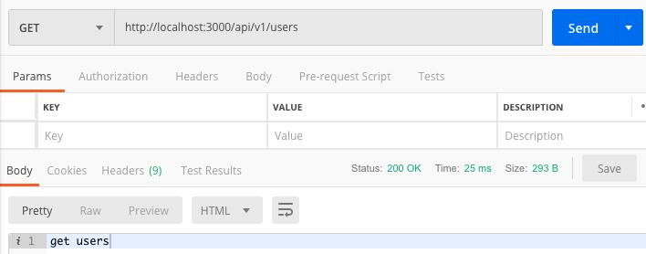

### GET By UID

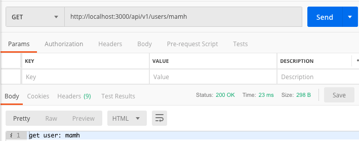

### POST Result


### POST By UID

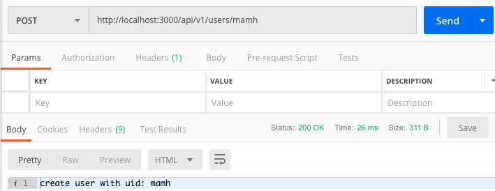

### PUT Result

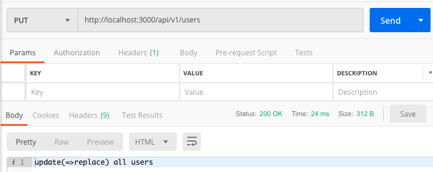

### PUT By UID Result

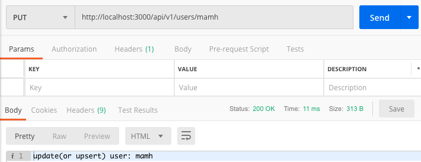

### DELETE Result


### DELETE By UID Result

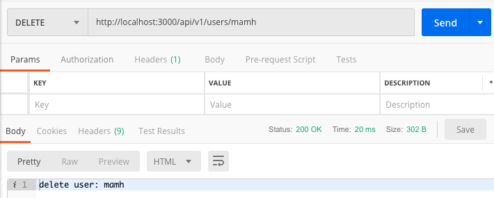

## Step 5 : Error Handling

REST API 작성이 완료되면 Error 처리를 위한 미들웨어를 작성합니다. error.js 파일을 생성하고 에러 핸들링 코드를 작성합니다.

```bash
├── api
│   ├── index.js
│   ├── utils         # create dir
│   │   └── error.js  # create file
│   └── v1
│       ├── index.js
│       └── users
│           └── index.js
├── package.json
├── serverless.yml
└── yarn.lock
```

```javascript
// api/utils/error.js
class ApiError extends Error {
  constructor(code, name, message) {
    super(message)
    if (Error.captureStackTrace) {
      Error.captureStackTrace(this, ApiError);
    }
    this.code = code
    this.name = name
  }
}

module.exports = ApiError
```

작성한 모듈을 express 미들웨어로 등록합니다.<br>
express는 순서대로 실행되기 때문에 에러 핸들러는 가장 하단에서 처리해야 하며 err 인자를 받기 위해선 4개의 파라메터를 모두 명시해야합니다.

```javascript
const awsServerlessExpress = require('aws-serverless-express')
const express = require('express')
const ApiError = require('./utils/error')   // 추가
const v1 = require('./v1')

const app = express()
app.use(express.json())
app.use('/api/v1', v1)
app.get('/api/ping', (req, res) => res.json({ ping: 'pong~'}))

// Error Handling 추가
app.use((err, req, res, next) => {
  console.error(err)
  const error = {
    code: 500,
    name: 'internal-server-error',
    message: err.message
  }
  if (err instanceof ApiError) {
    error.code = err.code
    error.name = err.name
  }
  res.status(error.code).send({ error })
})

const server = awsServerlessExpress.createServer(app)

exports.handler = (event, context) => awsServerlessExpress.proxy(server, event, context)
```

이제 테스트를 위해 /api/v1/users/index.js 모듈에 에러를 유발하는 코드를 작성합니다.<br>
기존 작성되어 있는 코드 중 get/:uid, post/:uid 라우트 메소드에 uid가 값이 admin일 경우 에러를 발생시키는 코드를 넣어보겠습니다.

```javascript
const express = require('express')
const ApiError = require('../../utils/error')   // Error 모듈 추가
const router = express.Router()

router.post('/:uid', (req, res, next) => {
  const { uid } = req.params

  // 일반 Error Handling 추가
  if(uid === 'admin') {
    return next(new Error('uid cannot be admin'))
  }

  res.send('create user with uid: '+ uid)
})

router.put('/:uid', (req, res, next) => {
  const { uid } = req.params

  // Custom Error Handling 추가
  if(uid === 'admin') {
    return next(new ApiError(400, 'bad-request', 'uid cannot be admin'))
  }

  res.send('update(or upsert) user: ' + uid)
})

module.exports = router
```

수정한 API를 Postman으로 호출해봅니다.

#### Error Result

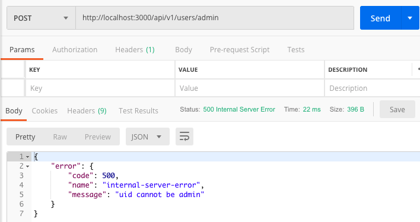

#### ApiError Result


### Error Tips

Error Handler에 정상적으로 예외를 처리하기 위해선 next()를 호출해야합니다.<br>
비동기 함수에서 throw new Error('msg')로 바로 에러를 던질 경우 정상적으로 동작하지 않습니다.<br>
또한 에러 처리를 위한 next() 호출 시 현재 진행 중인 flow를 중단하기 위해 return next()와 같이 처리합니다.

## Step 6 : Database Setup

Database 연결을 위해 Amazon RDS 서비스에서 Aurora DB를 생성합니다.


DB 연결을 위한 모듈을 작성합니다. /api/utils 에 다음 파일들을 생성하고 코드를 작성합니다.

```bash
├── api
│   ├── index.js
│   ├── utils
│   │   ├── error.js
│   │   ├── mysql.js      # create file - DB 모듈
│   │   └── secret.js     # create file - DB 인증 정보
│   └── v1
│       ├── index.js
│       ├── setup         # create dir
│       │   └── index.js  # create file
│       └── users
│           └── index.js
├── package.json
├── serverless.yml
└── yarn.lock
```

```js
// api/utils/secret.js
module.exports = {
  host     : 'xxxxx.ap-northeast-2.rds.amazonaws.com',    // DB Endpoint
  database : 'serverless_tutorial',                       // DB Name
  user     : 'admin',                                     // DB User
  password : 'SuperSecret'                                // DB Password
}
```

```js
// api/utils/mysql.js
const secret = require('./secret')
const mysql = require('serverless-mysql')()
mysql.config(secret)
module.exports = mysql
```

```js
// api/v1/setup/index.js
const express = require('express')
const router = express.Router()
const mysql = require('../../utils/mysql')

router.get('/', async (req, res, next) => {
  try {
    // create table: users
    await mysql.query('DROP TABLE IF EXISTS users')
    await mysql.query(`CREATE TABLE users (
      uid 	VARCHAR(64) NOT NULL,
      name	VARCHAR(64) NOT NULL,
      level	INT NOT NULL
    )`)
    // create table: user_items
    await mysql.query('DROP TABLE IF EXISTS user_items')
    await mysql.query(`CREATE TABLE user_items (
      id    BIGINT NOT NULL AUTO_INCREMENT,
      uid   VARCHAR(64) NOT NULL,
      name	VARCHAR(64) NOT NULL,
      cost	INT NOT NULL,
      PRIMARY KEY(id)
    )`)
    // create table: events
    await mysql.query('DROP TABLE IF EXISTS events')
    await mysql.query(`CREATE TABLE events (
      id      BIGINT NOT NULL AUTO_INCREMENT,
      title	  VARCHAR(64) NOT NULL,
      message	VARCHAR(1024) NOT NULL,
      score   INT NOT NULL,
      status  VARCHAR(64) NOT NULL,
      PRIMARY KEY(id)
    )`)
    // result
    res.send({ result: 'success' })
  } catch (error) {
    next(error)
  }
})

module.exports = router
```

v1 라우트 모듈에 setup 모듈을 포함시킵니다.

```javascript
// api/v1/index.js
const express = require('express')
const router = express.Router()
const routes = ['setup', 'users']   // setup 추가

routes.forEach(route => router.use('/' + route, require('./' + route)))

module.exports = router
```

새로 추가된 /api/v1/setup 라우트 메소드를 호출하여 정상적으로 결과가 나오는지 확인합니다.

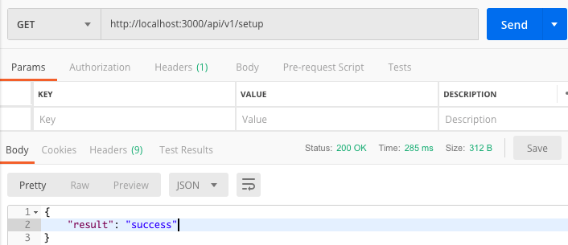


## Step 7 : User CRUD

본 스텝에선 앞서 만들었던 users 모듈에 DB 모듈을 연동하여 CRUD를 구현합니다.

```js
// /api/users/index.js
const express = require('express')
const ApiError = require('../../utils/error')
const router = express.Router()
const mysql = require('../../utils/mysql')

router.get('/', async (req, res, next) => {
  try {
    const users = await mysql.query('SELECT * FROM users')
    res.send(users)
  } catch (error) {
    next(error)
  }
})

router.get('/:uid', async (req, res, next) => {
  try {
    const { uid } = req.params
    const users = await mysql.query(`SELECT * FROM users WHERE uid='${uid}'`)
    users.length > 0 ? res.send(users[0]) : res.status(404).send()
  } catch (error) {
    next(error)
  }
})

router.post('/:uid', async (req, res, next) => {
  try {
    const { uid } = req.params
    const { name } = req.body
    // validation
    if (!name || name.length < 3) {
      return next(new ApiError(400, 'bad-request', 'Name cannot be empty and must be at least 3 characters.'))
    }
    // initial value
    const level = 1
    // insert
    await mysql.query(`INSERT INTO users VALUES ('${uid}', '${name}', ${level})`)
    // return object created
    res.send({ uid, name, level })
  } catch (error) {
    next(error)
  }
})

router.put('/:uid', async (req, res, next) => {
  try {
    const { uid } = req.params
    let { level } = req.body
    // validation
    if (!level) return next(new ApiError(400, 'bad-request', 'No Params.'))
    level = parseInt(level, 10)
    if (level > 100) return next(new ApiError(400, 'bad-request', 'Black User'))
    // update
    await mysql.query(`UPDATE users SET level=${level} WHERE uid='${uid}'`)
    res.send({ level })
  } catch (error) {
    next(error)
  }
})

module.exports = router
```

#### Test Case 1 - Post User


#### Test Case 2 - Put User


#### Test Case 3 - Get Users


#### Test Case 3 - Get User Info


## Step 8 : Extract, Filter, Sort, Pagination

본 스텝에선 REST API에서 추출, 필터, 소트, 페이징에 대한 내용을 기술합니다.

```bash
├── api
│   ├── index.js
│   ├── utils
│   │   ├── error.js
│   │   ├── mysql.js
│   │   └── secret.js
│   └── v1
│       ├── events        # create dir
│       │   └── index.js  # create file
│       ├── index.js
│       ├── setup
│       │   └── index.js
│       └── users
│           └── index.js
├── package.json
├── serverless.yml
└── yarn.lock
```

```js
// api/v1/events/index.js
const express = require('express')
const router = express.Router()
const mysql = require('../../utils/mysql')

router.get('/', async (req, res, next) => {
  try {
    console.log('test')
    let { fields, status, id, sort, limit, offset } = req.query
    // Extract
    fields = fields || '*'
    let query = `SELECT ${fields} FROM events`
    // Filter: match
    if (status) {
      query += ` WHERE status = '${status}'`
    }
    // Filter: range (id=lt:3, id=gt:4, id=in:3:5)
    if (id) {
      const idFilter = id.split(':')
      const delimiter = idFilter[0]
      const lhs = parseInt(idFilter[1], 10)
      const rhs = idFilter[2] ? parseInt(idFilter[2], 10) : 0
      query += status ? ' AND ' : ' WHERE '
      switch(delimiter) {
        case 'lt':
          query += `id < ${lhs}`
          break
        case 'gt':
          query += `id > ${lhs}`
          break
        case 'in':
          query += `${lhs} <= id AND id <= ${rhs}`
          break
      }
    }
    // Sort
    if (sort) {
      query += ` ORDER BY ${sort}`
    }
    // Pagination
    limit = limit || 100 // default limit(or you can set max limit)
    if (limit) {
      query += ` LIMIT ${limit}`
    }
    if (offset) {
      query += ` OFFSET ${offset}`
    }

    const events = await mysql.query(query)
    res.send(events)
  } catch (error) {
    next(error)
  }
})

router.post('/', async (req, res, next) => {
  try {
    // Authentication: Pseudo  code
    // if (!isAdmin) return next(new ApiError(403, 'forbidden', 'Not Authorized.'))

    let { title, message, status, score } = req.body
    const { insertId: id } = await mysql.query(`INSERT INTO events(title, message, score, status) VALUES ('${title}', '${message}', '${score}', '${status}')`)
    res.send({ id, title, message, status, score })
  } catch (error) {
    next(error)
  }
})

router.put('/:id', async (req, res, next) => {
  try {
    // Authentication: Pseudo  code
    // if (!isAdmin) return next(new ApiError(403, 'forbidden', 'Not Authorized.'))

    const { id } = req.parmas
    const { open } = req.body
    await mysql.query(`UPDATE events SET open = ${open} WHERE id = ${id}`)
    res.send({ id, open })
  } catch (error) {
    next(error)
  }
})

module.exports = router
```

v1 라우트 모듈에 events 모듈을 포함시킵니다.

```javascript
// api/v1/index.js
const express = require('express')
const router = express.Router()
const routes = ['setup', 'users', 'events']   // events 추가

routes.forEach(route => router.use('/' + route, require('./' + route)))

module.exports = router
```

#### Test Case 1 - POST를 통한 기본 데이터 입력. 정렬을 위해 예제와 동일하게 3개 정도 입력합니다.

##### event1-open

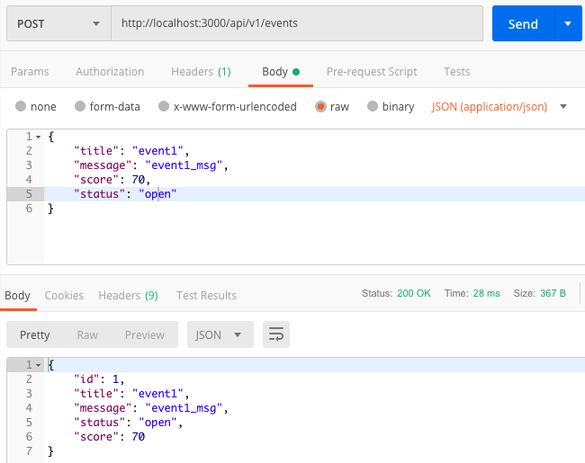

##### event2-close


##### event3-open

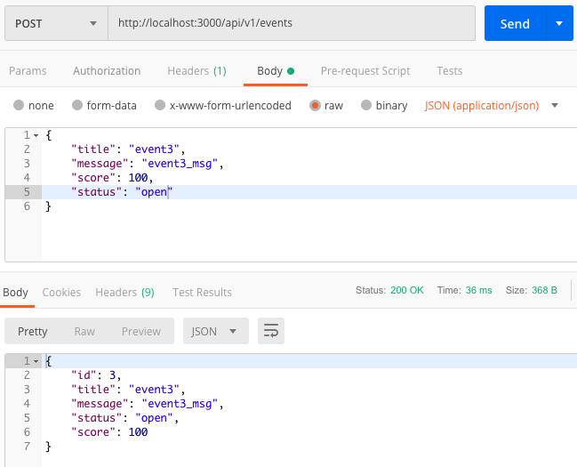

#### Test Case 2 - Extract

##### 모든 유저 반환

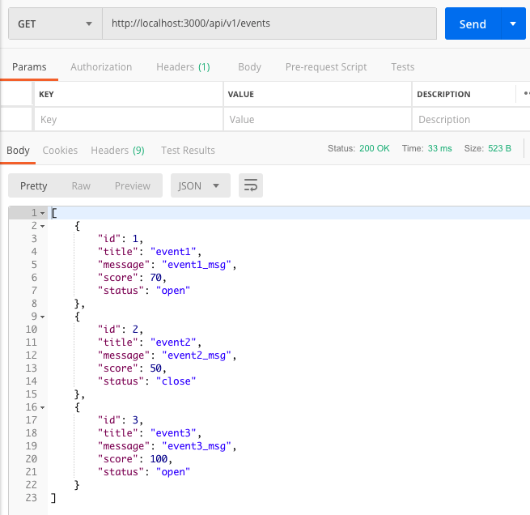

#####  유저 리스트에서 id, title 필드만 추출

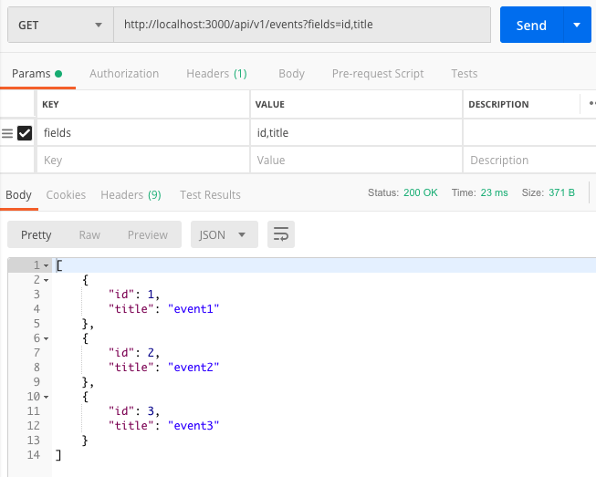

##### 유저 리스트에서 status가 open인 유저만 추출


##### 유저 리스트에서 id가 3보다 작은 그룹 (lt:3)


##### 유저 리스트에서 id가 2와 3을 포함하는 그룹 (in:2:3)

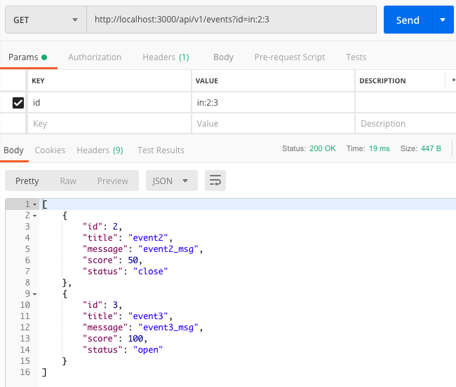

#### Test Case 3 - Sort

#####  유저 리스트에서 score 순으로 정렬


#### Test Case 4 - Pagination

##### 유저 리스트 1번째 row를 시작으로 2개 선택


## Step 9 : Nested Route

본 스텝에선 중첩퇸 라우트를 구현합니다.

```bash
├── api
│   ├── index.js
│   ├── utils
│   │   ├── error.js
│   │   ├── mysql.js
│   │   ├── secret.js
│   │   └── secret2.js
│   └── v1
│       ├── events
│       │   └── index.js
│       ├── index.js
│       ├── setup
│       │   └── index.js
│       └── users
│           ├── index.js
│           └── items         # create dir
│               └── index.js  # create file
├── package.json
├── serverless.yml
└── yarn.lock
```

express.Router의 mergeParams: true 옵션은 부모 라우트의 req.params 값을 전달받을 수 있게 합니다.<br>
본 예제에선 /api/v1/users/:uid/items로 넘어오는 :uid 값을 items에서 사용할 수 있게 됩니다.

```js
// api/v1/users/items/index.js
const express = require('express')
const router = express.Router({ mergeParams: true })
const mysql = require('../../../utils/mysql')

router.get('/', async (req, res, next) => {
  try {
    const { uid } = req.params
    const items = await mysql.query(`SELECT * FROM user_items WHERE uid = '${uid}'`)
    res.send(items)
  } catch (error) {
    next(error)
  }
})

router.get('/:itemId', async (req, res, next) => {
  try {
    const { uid, itemId } = req.params
    const items = await mysql.query(`SELECT * FROM user_items WHERE uid = '${uid}' AND id = ${itemId}`)
    items.length > 0 ? res.send(items[0]) : res.status(404).send()
  } catch (error) {
    next(error)
  }
})

router.post('/', async (req, res, next) => {
  try {
    const { uid } = req.params
    const { name, cost } = req.body

    // initial value
    const level = 1
    // insert
    const { insertId: id } = await mysql.query(`INSERT INTO user_items(uid, name, cost) VALUES ('${uid}', '${name}', ${cost})`)
    // return object created
    res.send({ id, uid, name, cost })
  } catch (error) {
    next(error)
  }
})

module.exports = router
```

users 라우트 모듈을 열고 새로 작성한 items 모듈을 추가한 후 코드 마지막 부분에 items 라우트를 users 라우터에 등록합니다.

```javascript
// api/v1/users/index.js
const express = require('express')
const ApiError = require('../../utils/error')
const router = express.Router()
const mysql = require('../../utils/mysql')
const items = require('./items')     // 추가

// 중간 생략 ...

// Nested Route : items
router.use('/:uid/items', items)     // 추가

module.exports = router
```

이제 "/api/v1/users/${mamh}/items" 형식의 endpoint로 items API를 호출할 수 있습니다.

#### Test Case 1 - Post Items. 같은 방법으로 item2, item3 까지 만들어 줍니다.


#### Test Case 2 - Get All Items


#### Test Case 3 - Get Item Info


## Step 10 : Deploy

본 스텝은 작성된 코드를 AWS에 배포하는 내용을 다룹니다.

### 사전 준비 - IAM

배포에는 IAM 사용자 인증이 필요합니다. [AWS Console](https://console.aws.amazon.com/iam/home?region=ap-northeast-2#/home)에 로그인 한 후 IAM 섹션으로 이동합니다.

먼저 신규 IAM 사용자를 위한 그룹을 생성합니다.


그룹 이름을 설정합니다


**정책 연결 시 필요한 권한만 선택해야 하나 튜토리얼 편의상 전체 권한인 AdministratorAccess를 부여했습니다.<br>실 서비스 사용시엔 필요한 권한만 선택하세요**


그룹 생성을 완료합니다


이제 배포에 사용될 사용자 계정을 생성합니다.

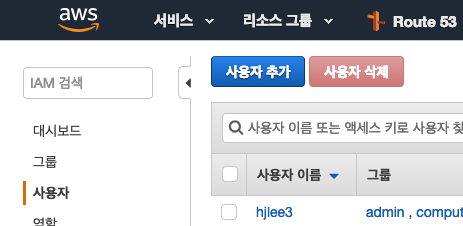

**사용자 이름을 지정하고 프로그래밍 방식 엑세스를 선택합니다.<br>
해당 IAM은 console 명령어를 사용하지 않으므로 AWS Management Console 엑세스는 선택하지 않습니다**


앞에서 만들어둔 그룹에 해당 사용자를 추가합니다.

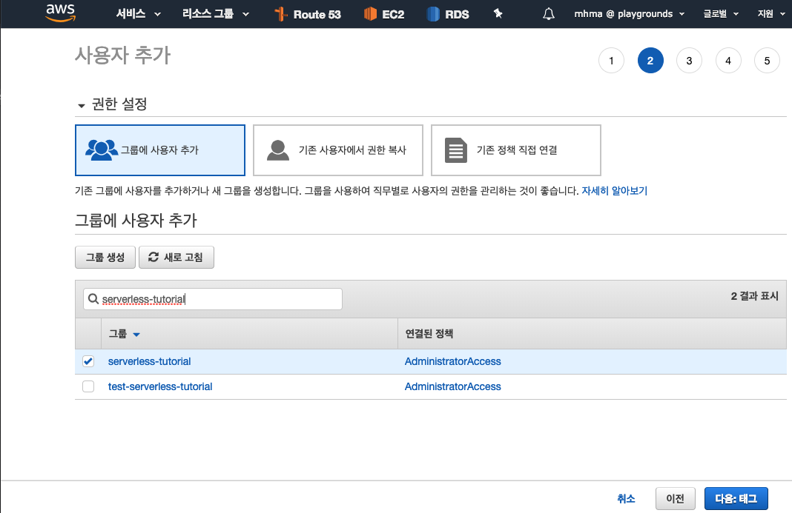

태그는 설정하지 않고 다음으로 이동 후 사용자 만들기를 선택합니다.


**엑세스 키 ID 및 비밀 엑세스 키를 메모장에 붙여둡니다.<br>
비밀 엑세스키는 이 단계가 넘어가면 재 확인이 불가능하나 신규 생성으로 재발급 가능하니 반드시 기억할 필요는 없습니다**


### 사전 준비 - Serverless Auth

Serverless Framework에서 사용하기 위한 인증 파일을 생성합니다.<br>
이 파일 생성을 위해 IAM 생성시 발급된 엑세스 키 ID 및 비밀 엑세스 키를 사용합니다.<br>
Serverless Framework는 aws 인증을 위해 ~/.aws/credentials 파일을 참조합니다.<br>
이 파일을 생성하는 방법은 aws-cli를 이용하거나 Serverless Framework에서 제공하는 cli를 통해 생성할 수 있습니다.<br>
이 챕터에선 Serverless Framework CLI로 진행하는 방법을 설명합니다.<br>
다음 명령어를 실행하여 AWS Credentials 파일을 생성합니다.

```bash
$ serverless config credentials --provider aws --key <엑세스 키 ID> --secret <비밀 엑세스 키> -o
Serverless: Setting up AWS...
Serverless: Saving your AWS profile in "~/.aws/credentials"...
Serverless: Success! Your AWS access keys were stored under the "default" profile.
$ cat ~/.aws/credentials
[default]
aws_access_key_id = XXXXXXXXX
aws_secret_access_key = XXXXXXXXXXX
```

모든 준비가 끝났습니다. 이제 deploy 명령어로 AWS에 배포를 진행합니다.

```bash
$ yarn deploy
yarn run v1.13.0
$ serverless deploy
Serverless: Packaging service...
Serverless: Excluding development dependencies...
Serverless: Creating Stack...
Serverless: Checking Stack create progress...
.....
Serverless: Stack create finished...
Serverless: Uploading CloudFormation file to S3...
Serverless: Uploading artifacts...
Serverless: Uploading service serverless-tutorial-dev.zip file to S3 (2.92 MB)...
Serverless: Validating template...
Serverless: Updating Stack...
Serverless: Checking Stack update progress...
..............................
Serverless: Stack update finished...
Service Information
service: serverless-tutorial-dev
stage: prod
region: ap-northeast-2
stack: serverless-tutorial-dev-prod
resources: 10
api keys:
  None
endpoints:
  ANY - https://xv0lm0e8rk.execute-api.ap-northeast-2.amazonaws.com/prod/api/{proxy+}
functions:
  api: serverless-tutorial-dev-prod-api
layers:
  None
✨  Done in 89.79s.
```

#### 배포 후 생성 확인 - CloudFormation


#### 배포 후 생성 확인 - API Gateway

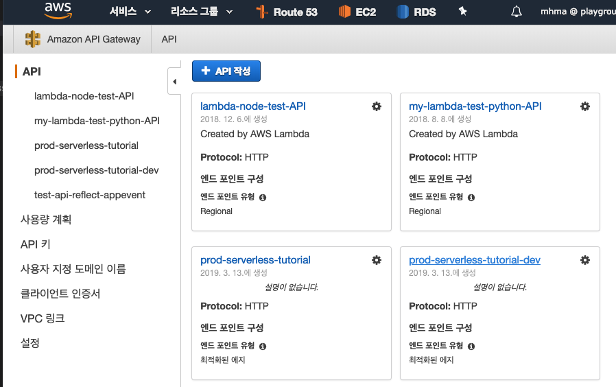


#### 배포 후 생성 확인 - Lambda


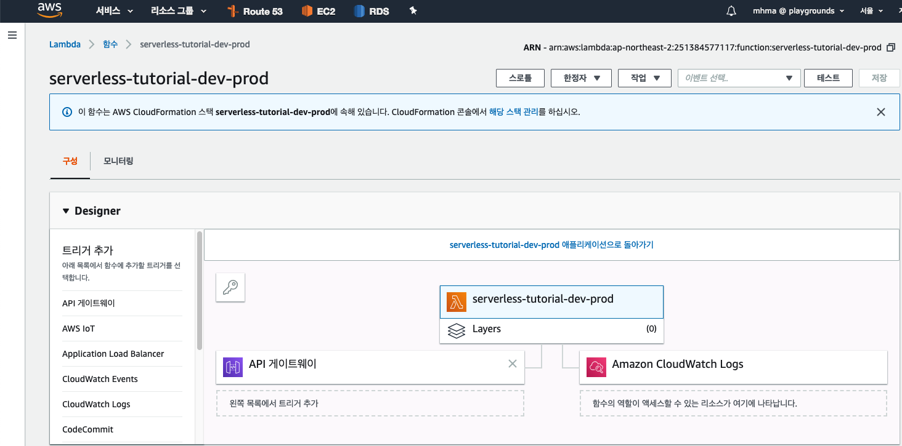

### Test Case - Lambda Endpoints 테스트

##### Endpoints로 API를 호출합니다. Endpoints 확인을 위해 AWS Lambda 서비스 페이지에서 API Gateway를 선택합니다


#####  테스트 삼아 마지막에 로컬에서 테스트한 API의 Endpoint를 변경하여 호출해봅니다.


## (Bonus) Step 11 : JWT Token을 이용한 간단한 인증처리

JSON Web Token(JWT)은 웹표준 (RFC 7519) 으로서 사용자의 인증정보를 암호화하여 전달하고 확인 할 수 있는 방법을 제공합니다. <br>
본 스텝에선 JWT를 이용하여 인증하는 방법에 대해 간단하게 구현하는 내용을 담고 있습니다.<br>

### JWT Module 설치

```bash
$ yarn add express-jwt # or npm i express-jwt
```

### API 작성

```bash
├── api
│   ├── index.js
│   ├── utils
│   │   ├── error.js
│   │   ├── mysql.js
│   │   └── secret.js
│   └── v1
│       ├── auth          # create dir
│       │   └── login.js  # create file
│       ├── events
│       │   └── index.js
│       ├── index.js
│       ├── setup
│       │   └── index.js
│       └── users
│           ├── index.js
│           └── items
│               └── index.js
├── package.json
├── serverless.yml
└── yarn.lock
```

```js
// api/v1/auth/login.js
const express = require('express')
const jwt = require('jsonwebtoken')

const router = express.Router()

router.post('/login', async (req, res, next) => {
  const { uid } = req.body
  const token = jwt.sign({ uid }, 'SUPERSECRET', { expiresIn: '7d' })
  res.send({ uid, token })
})

module.exports = router
```

추가된 auth 모듈을 v1 라우트 모듈에 추가합니다.

```javascript
// api/v1/auth/index.js
const express = require('express')
const router = express.Router()
const routes = ['setup', 'users', 'events', 'auth']   // auth 추가

routes.forEach(route => router.use('/' + route, require('./' + route)))

module.exports = router
```

root index.js에 jwt 인증을 미들웨어로 등록합니다.<br>
이제 unless에 등록된 라우트를 제외한 모든 api는 jwt 토큰이 없으면 에러를 발생하게 됩니다.

```javascript
const awsServerlessExpress = require('aws-serverless-express')
const express = require('express')
const ApiError = require('./utils/error')
const v1 = require('./v1')
const jwt = require('express-jwt')      // 추가

const app = express()
app.use(express.json())
app.use(jwt({ secret: 'SUPERSECRET' }).unless({ path: ['/ping', '/api/v1/auth/login'] }))  // 추가
app.use((err, req, res, next) => { err.name === 'UnauthorizedError' ? next(new ApiError(401, 'auth-error', err.message)) : next() })  // 추가

app.use('/api/v1', v1)
app.get('/api/ping', (req, res) => res.json({ ping: 'pong~'}))

// Error Handling
app.use((err, req, res, next) => {
  console.error(err)
  const error = {
    code: 500,
    name: 'internal-server-error',
    message: err.message
  }
  if (err instanceof ApiError) {
    error.code = err.code
    error.name = err.name
  }
  res.status(error.code).send({ error })
})

const server = awsServerlessExpress.createServer(app)

exports.handler = (event, context) => awsServerlessExpress.proxy(server, event, context)
```

이제 Login API를 호출하여 Token 발급 테스트를 진행합니다.<br>
UID를 인자로 전달하고 Token을 발급 받아 이후 API 통신에 인증 키로 활용될 수 있습니다.<br>
<b>경고: 실무에서는 User의 실질적인 인증정보(ID,PWD 또는 OAuth등을 활용하여야 합니다.</b>

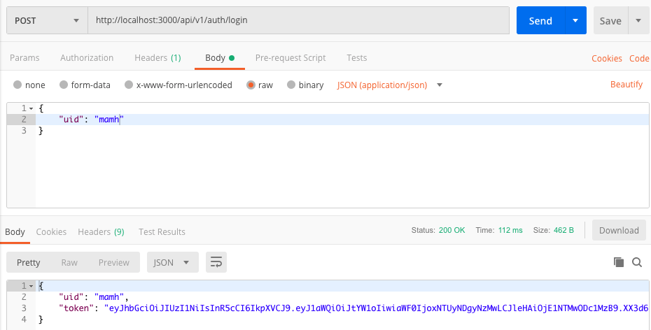

위에서 얻은 Token으로 users PUT Methods를 호출해봅니다.<br>
우선 Token이 없을 때의 결과 입니다.<br>


이제 토큰 값을 추가하여 호출합니다. Postman의 Authorization 탭을 선택한 후 TYPE을 Bearer Token으로 지정합니다. 그리고 Token 입력 폼에 발급 받은 Token 값을 입력한 후 Preview Requests를 눌러 헤더 값을 설정 합니다.<br>

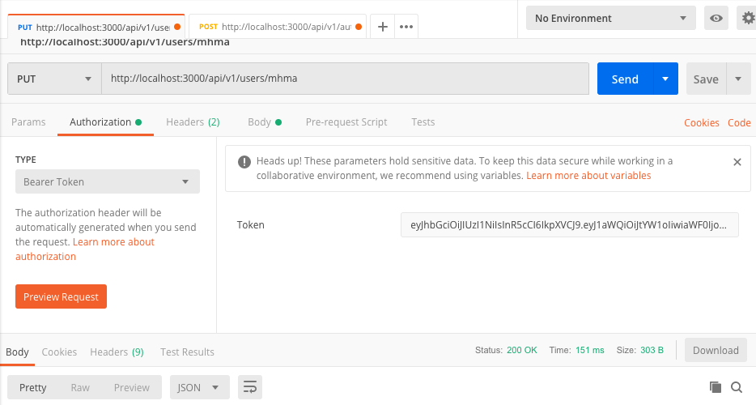

이제 users PUT method를 호출합니다. mamh UID의 level을 70으로 변경합니다.<br>

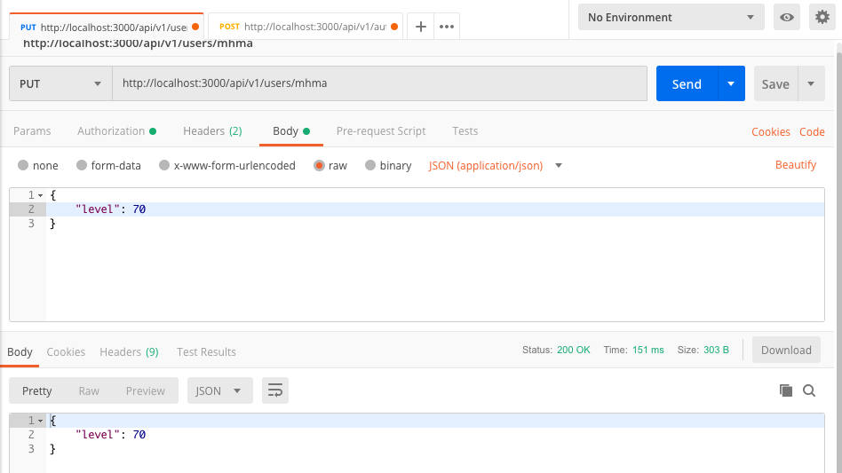

## (Bonus) Step 12 : Cron

본 스텝은 Lambda를 이용하여 Cron (Scheduled Lambda)을 설정하는 방법을 기술합니다.<br>
우선 Cron을 돌리기 위한 스케쥴러를 작성합니다. 스케쥴러는 POST events API를 호출하여 이벤트를 1분마다 생성할 것입니다.

```bash
.
├── api
│   ├── index.js
│   ├── utils
│   │   ├── error.js
│   │   ├── mysql.js
│   │   └── secret.js
│   └── v1
│       ├── auth
│       │   └── index.js
│       ├── events
│       │   └── index.js
│       ├── index.js
│       ├── setup
│       │   └── index.js
│       └── users
│           ├── index.js
│           └── items
│               └── index.js
├── package.json
├── scheduler             # create dir
│   └── daily-events.js   # create file
├── serverless.yml
└── yarn.lock
```

아래 코드를 daily-events.js에 작성합니다.

```js
// scheduler/daily-events.js
const mysql = require('../api/utils/mysql')

exports.handler = async (event, context) => {
  try {
    const title = 'cron_events'
    const message = new Date().toTimeString()
    const score = 100
    const status = 'open'
    await mysql.query(`INSERT INTO events(title, message, score, status) VALUES ('${title}', '${message}', '${score}', '${status}')`)
  } catch (error) {
    console.log(error)
  }
}
```

serverless.yml 파일을 열고 스케쥴러에 대한 스크립트를 작성합니다.<br>
람다 크론식에 대해 자세히 알고 싶으시면 [AWS rate 또는 cron을 사용한 예약 표현식](https://docs.aws.amazon.com/ko_kr/lambda/latest/dg/tutorial-scheduled-events-schedule-expressions.html)을 참고하도록 합니다.

```bash
service: serverless-tutorial
provider:
  name: aws
  runtime: nodejs8.10
  stage: prod             # optional, default: dev
  region: ap-northeast-2	# optional, default: us-east-1
  memorySize: 128         # optional, in MB, default: 1024
  timeout: 30             # optional, in seconds, default: 6
  versionFunctions: false # optional, default: true
functions:
  api:
    name: ${self:service}-${self:provider.stage}
    handler: api/index.handler
    events:
      - http: ANY /api/{proxy+}
  scheduler:  # 1분 마다 scheduler/daily-events.js가 실행되도록 추가
    name: ${self:service}-${self:provider.stage}-scheduler
    handler: scheduler/daily-events.handler
    events:
      - schedule:
          rate: cron(*/1 * ? * * *)
          enabled: true
plugins:
  - serverless-offline
  - serverless-offline-scheduler
```

yarn dev 명령어를 실행하여 콘솔 로그를 확인합니다.

```bash
$ yarn dev
yarn run v1.13.0
$ serverless offline start
Serverless: scheduler: scheduling scheduler/scheduler with */1 * ? * *
Serverless: Starting Offline: prod/ap-northeast-2.

Serverless: Routes for api:
Serverless: ANY /api/{proxy*}

Serverless: Routes for scheduler:
Serverless: (none)

Serverless: Offline listening on http://localhost:3000
Serverless: scheduler: running scheduled job: scheduler
Serverless: scheduler: running scheduled job: scheduler
Serverless: scheduler: running scheduled job: scheduler
```

DB에 데이터를 확인해봅니다.<br>


yarn deploy를 실행하여 배포를 진행합니다.

결과 화면에 scheduler가 추가된 것을 확인할 수 있습니다.

```bash
$ yarn deploy
yarn run v1.13.0
$ serverless deploy
Serverless: Packaging service...
Serverless: Excluding development dependencies...
Serverless: Uploading CloudFormation file to S3...
Serverless: Uploading artifacts...
Serverless: Uploading service serverless-tutorial-dev.zip file to S3 (4.36 MB)...
Serverless: Validating template...
Serverless: Updating Stack...
Serverless: Checking Stack update progress...
..............
Serverless: Stack update finished...
Service Information
service: serverless-tutorial-dev
stage: prod
region: ap-northeast-2
stack: serverless-tutorial-dev-prod
resources: 14
api keys:
  None
endpoints:
  ANY - https://xv0lm0e8rk.execute-api.ap-northeast-2.amazonaws.com/prod/api/{proxy+}
functions:
  api: serverless-tutorial-dev-prod-api
  scheduler: serverless-tutorial-dev-prod-scheduler
layers:
  None
Serverless: Removing old service artifacts from S3...
✨  Done in 88.06s.
```

AWS Lambda 서비스 페이지에서 모니터링 탭을 선택하여 제대로 호출되고 있는지 확인합니다.<br>
Invocations가 증가하는 모습을 확인할 수 있습니다.


## (Bonus) Step 13 : BreakPoint

VSCode를 이용하여 BreakPoint로 디버깅하는 방법에 대해 소개합니다.<br>

#### package.json - scripts에 debug 스크립트를 추가

```javascript
"scripts": {
  "dev": "serverless offline start",
  "deploy": "serverless deploy",
  "debug": "export SLS_DEBUG=* && node --debug ./node_modules/serverless/bin/serverless offline -s dev"
}
```

#### VSCode Left Menu에서 Debug Menu를 선택합니다.

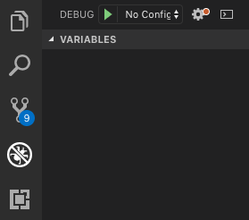

#### 상단 No Configuration을 누르고 Add Configuration을 선택합니다.


#### Node.js를 선택하면 laugnch.json 파일이 생성됩니다.

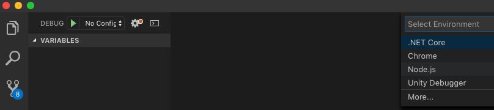

#### 다음 코드를 launch.json에 작성합니다.

```js
{
  "version": "0.2.0",
  "configurations": [
    {
      "type": "node",
      "request": "launch",
      "name": "Serverless",
      "program": "${workspaceFolder}/node_modules/serverless/bin/serverless",
      "cwd": "${workspaceFolder}",
      "args": [
        "offline",
        "start",
        "--stage=development",
        "--region=us-west-2",
        "--host=localhost",
        "--port=3000",
        "--noTimeout"
      ],
      "sourceMaps": true,
      "smartStep": true
    }
  ]
}
```


##### 이제 auth/login API를 디버깅해보겠습니다. /api/v1/auth/index.js을 열고 8번 줄 const token 변수에 브레이킹 포인트를 잡습니다. (F9 키 혹은 스크린샷 빨간 점 부분 마우스로 선택)


#### 왼쪽 상단 DEBUG 버튼을 누르면 Debugging Watch가 시작됩니다.


#### auth/login API를 호출하여 VSCode에서 디버깅 정보를 확인합니다.


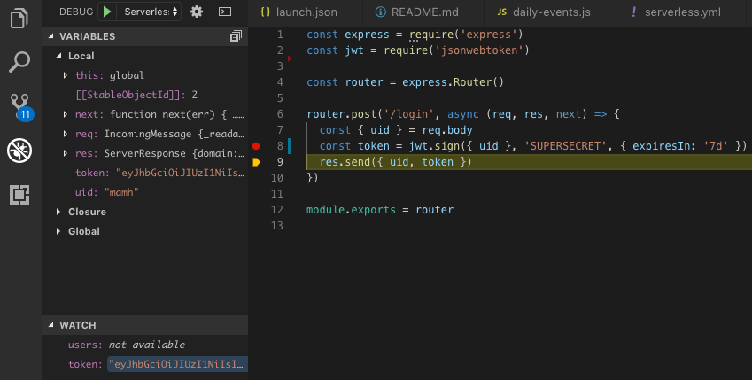


