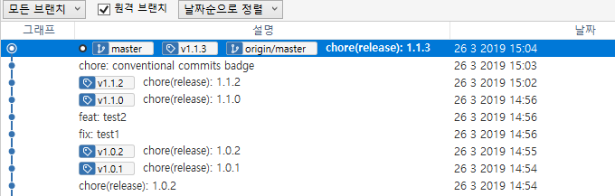

---
meta:
  - name: description
    content: Conventional Commits을 통해 SemVer 및 CHANGELOG를 자동화하는 방법입니다. husky 와 commitlint를 활용합니다.
  - name: keywords
    content: 쿡앱스 cookapps git conventional comit husky commitlint semver changelog 자동화
---

# Conventional Commits

본 포스팅의 완성 된 [예제 소스](https://github.com/cookpi/example-conventional-commits.git)는 GitHub에 올려져 있습니다.

## 개요

[Conventional Commits](https://www.conventionalcommits.org/)이란 git 으로 commit 시에 일괄된 양식을 유지하고 그 양식을 바탕으로 버전 관리나 Change Log 를 만들어 냄을 의미합니다. 컨벤션의 일환이지만 npm 모듈을 통하여 강제로 적용하여 실수가 일어나지 않게 합니다.

전체적인 흐름은 git commit > git hook > husky > commitlint 순서로 진행됩니다. commit 을 하게 되면 git hook 이 발생하고 husky 가 트리거를 받아서 commitlint 실행하게 하게 되고 규칙에 맞는 commit 로그 일 경우 통과 시키고 그러지 않으면 commit 을 실패 시킵니다.

* [husky](https://www.npmjs.com/package/husky): git hook 을 트리거 하는 용도
* [commitlint](https://conventional-changelog.github.io/commitlint): commit 에 대한 lint를 확인하여 성공/실패를 리턴합니다.

commitlint 를 직접 작성 할 수도 있지만 Google(Angular)등에서 사용하는 이미 정의된 설정을 사용하고 필요에 의해서 확장하여 사용합니다.

## 설치

```bash
yarn add husky @commitlint/cli @commitlint/config-conventional -D
```

::: warning
husky가 githook 을 덮어쓰기 때문에 husky 설정 이전에 repo를 먼저 초기화 해야 합니다.
:::

## 설정

11-20 라인을 추가합니다.

```json{11-20}
// package.json
{
  "name": "test-conventionalcommits",
  "description": "example-conventional-commits",
  "version": "1.0.0",
  "author": "jwkim2 <jwkim2@cookapps.com>",
  "license": "MIT",
  "devDependencies": {
    "@commitlint/cli": "^7.5.2",
    "@commitlint/config-conventional": "^7.5.0",
    "husky": "^1.3.1"
  },
  "husky": {
    "hooks": {
      "commit-msg": "commitlint -E HUSKY_GIT_PARAMS"
    }
  },
  "commitlint": {
    "extends": [
      "@commitlint/config-conventional"
    ]
  }
}
```

* husky: commit-msg 라는 git hook이 실행되면 commitlint를 실행합니다.
* commitlint: commitlint에서 제공하는 commitlint/config-conventional를 상속(확장)합니다.

## 사용법

다음과 같은 형식으로 commit을 합니다.

```
<type>[optional scope]: <description>

# Examples

fix: allow login without uid
feat: add chat function
BREAKING CHANGE: 'extend' > 'inherit', must fix all the codes

# Examples with optional scope

fix(chat): broken emoji
feat(auth): add Google Play Auth
```

| Type            | SemVer | Description                         |
| --------------- | ------ | ----------------------------------- |
| fix             | PATCH  | Bug Fix, API 변경 사항 없이 내부 수정 |
| feat            | MINOR  | 기능 추가, API 변경(하위 호환)        |
| BREAKING CHANGE | MAGER  | API 의 변경, 큰 변화                 |
| refactor        |        | 내부적인 리펙토링                    |
| docs            |        | 문서                                |
| test            |        | 테스트 코드                          |
| chore           |        | 그외 자잘한 수정 사항들               |

형식에 맞지 않는 commit message 를 사용할 경우 commit이 실패 합니다.

Conventional Commits은 SemVer를 따르기 때문에 MAGER.MINOR.PATCH 에 해당하는 type을 사용하면 차후 release 할때 자동으로 해당 하는 버전이 올라가고 나머지는 버전을 올라가지 않습니다.

## CHANGELOG 자동화

git에 commit된 내용을 바탕으로 버저닝과 CHANGELOG.md를 자동으로 생성하는 방법입니다. 기본적인 원리는 단순히 git에 commit 된 로그를 뒤져서 package.json 에 새로운 버전을 명시하고 CHANGELOG.md에 해당 내용을 추가하는 방식입니다. 위에 설정한 husky와 commitlint와 직접적인 의존성이 존재하지 않습니다. 직접 git hook 과 git command 를 이용하여 구현도 가능합니다만 이미 다양한 npm 패키지들이 있고 저희는 [standard-version](https://www.npmjs.com/package/standard-version)이라는 npm 모듈을 사용합니다.

[standard-version](https://www.npmjs.com/package/standard-version)은 다음과 같은 일련의 과정들을 자동화 해줍니다.

1. git 의 commit 로그를 확인하여 새로운 version을 생성하고 packet.json 에 version 필드를 갱신합니다.
2. Conventional Commits 에 해당하는 내용을 CHANGELOG.md 파일에 추가합니다.
3. 두가지 내용을 묶어서 한번에 chore(release): 버전명(예: 1.1.2) 형태의 메시지로 커밋합니다.
4. 버전명을 Tag로 만들어서 git에 추가합니다.

완료된 형태는 다음과 같습니다.



::: warning
Monorepo 를 사용하는 경우 lerna를 활용하여 패키지별 버저닝 및 CHAGELOG 자동화를 하기 때문에 본 내용을 적용하면 충돌이 납니다. Monorepo 에서의 버저닝 및 CHANGELOG 자동화는 [Monorepo](/guide/monorepo/)를 참고바랍니다.
:::

### 설치 및 설정

패키지를 설치하고 package.json 에 스크립트를 추가합니다.

```bash
yarn add standard-version -D
```

```json
// package.json
{
  ...
  "scripts": {
    "release": "standard-version"
  }
}
```

### 사용법

```bash
yarn release --first-release # 최초에 한번: CHANGELOG.md 파일을 생성함

yarn release # 새로운 버전을 생성하고 CHANGELOG.md 버전 내용을 추가 및 커밋
```

